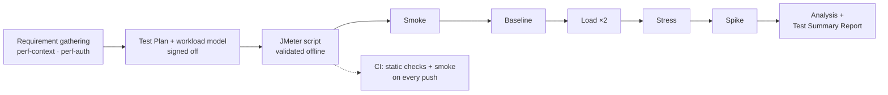

# DummyJSON Performance Testing


**[Test Summary Report](docs/test-summary-report.md)** · **[Performance Test Plan](context/perf-test-plan.md)** · **[Live dashboards](https://anusreepsuresh074.github.io/ecommerce-performance-testing/)** · **[Beginner's guide + 193 interview Q&A](docs/beginners-guide.md)**

Performance testing of the [DummyJSON](https://dummyjson.com) e-commerce API with **Apache JMeter 5.6.3**, done the way a QA team runs it: requirement gathering → a signed-off **Performance Test Plan** with a workload model → scripting → execution with entry/exit criteria → an analysed **Test Summary Report** → CI.

Virtual users follow a real shopper journey (log in → who am I → browse → search → open a product) at normal, peak and surge load, and every run is judged **PASS, FAIL or INVALID** against the plan's SLAs.

This is the performance companion to my [DummyJSON API test automation](https://github.com/Anusreepsuresh074/ecommerce-api-automation) suite, which tests the same API for correctness.

## What this project demonstrates

| Skill | Where to see it |
|---|---|
| **Requirement gathering:** an NFR questionnaire, limits found in the API's source code and confirmed live, a single-user baseline | [`context/perf-context.md`](context/perf-context.md) |
| **A standard Performance Test Plan:** scope, SLAs, workload model, scenarios, entry/exit/suspension criteria, risks, sign-off | [`context/perf-test-plan.md`](context/perf-test-plan.md) |
| **Workload modelling:** Little's Law, pacing, think time, a throughput budget under a rate limit | Plan, section 6 |
| **JMeter scripting:** transactions, correlation, parameterisation, assertions, a modular Test Fragment, property-driven Thread Groups, no plugins | [`test-plans/`](test-plans/README.md) |
| **Script validation without touching the target:** a local stub of the API and 37 automated checks, run in CI on every push | [`tests/offline/`](tests/offline/run-offline-checks.sh) |
| **Secure test design:** credentials kept out of the command line, logs, results and reports, *verified* rather than assumed | [`context/perf-auth.md`](context/perf-auth.md) |
| **Execution discipline:** smoke → baseline → load ×2 → stress → spike, caps checked before every run, a pre-run check, injector CPU monitoring | [`scripts/run-scenario.sh`](scripts/run-scenario.sh) |
| **Analysis:** SLA compliance, degradation vs baseline, repeatability, trends, observations with evidence, recommendations | [`docs/test-summary-report.md`](docs/test-summary-report.md) |
| **CI:** static checks and offline validation, then smoke on every push, load by hand, dashboards published to Pages | [`.github/workflows/perf.yml`](.github/workflows/perf.yml) |

## Results (2026-09-28)

**All 6 runs valid; every gated run meets every SLA.** 3,523 samples, 1 error (an isolated 30 s socket timeout), 0 rate-limit responses.

| Scenario | Users | p90, worst transaction (SLA) | Errors | Verdict |
|---|---|---|---|---|
| PT-01 Smoke | 1 | — | 0 | ✅ PASS |
| PT-02 Baseline | 1 | 1093 ms (10 samples) | 0 | ✔️ VALID (reference, not gated) |
| PT-03 Load, run 1 / run 2 | 6 | 714 / 757 ms (≤ 1500), steady state | 0% / 0% in steady state; whole run 0% / 0.13% (the timeout, 3.8 s before steady state) | ✅ PASS / ✅ PASS |
| PT-05 Stress (step-up) | 3 → 15 | 796 ms at the 12-user step (≤ 2000) | 0 | ✅ PASS |
| PT-06 Spike | 6 → 15 → 6 | 729 ms in the spike (≤ 2000); recovery 0.88× | 0 | ✅ PASS |


- **No degradation from 1 to 15 users:** medians at 15 users were 0.82–1.04× the single-user baseline.
- **Throughput scaled linearly**, exactly as the workload model predicted (0.208 req/s per user).
- **Two findings need care:**
  - **Repeatability:** the two load runs' steady-state medians agree within 7%, but their p90s differ by up to 40%, missing the plan's 10% repeatability rule for **3 of 5** transactions. The cause is internet tail latency; it's investigated in the report, section 6.2, with a recommended rule change.
  - **Generous SLAs:** they were set from a `curl` baseline before the JMeter baseline existed, so the measured p90 of about 0.7 s never came near the 1.5 s target. The report recommends tighter SLAs for the next cycle.

**From CI too:** a load run from GitHub Actions also passed (p90 at most 303 ms from GitHub's faster network, 1 dropped connection in 797 requests); see report section 13.

Evidence for every number: [`docs/evidence/`](docs/evidence/), with one verdict summary per run plus all analysis tables, regenerated from the raw results by `scripts/evaluate-run.py` and `scripts/build-report-data.py --evidence`.

## Approach



### Workload model

One business journey, run by each virtual user as one shopper session, **every 24 s** (pacing), with 2–4 s of think time between steps:

| ID | Transaction | Request |
|---|---|---|
| T01 | `T01_Login` | `POST /auth/login` → correlate `accessToken` |
| T02 | `T02_Get_Current_User` | `GET /auth/me` with the Bearer token |
| T03 | `T03_Browse_Products` | `GET /products?limit=30&skip=<random>` |
| T04 | `T04_Search_Products` | `GET /products/search?q=<CSV term>` → correlate a random `productId` |
| T05 | `T05_View_Product` | `GET /products/<productId>` |

Users are sized with **Little's Law** (`N = X × pacing`): a normal load of 900 journeys/hour is **6 users**, peak (200%) is **12**, and the stress top (250%) is **15**. That's at most 31% of DummyJSON's rate limit of 100 requests per 10 s per IP.

### Scenarios

| ID | Type | Users | Duration | Profile |
|---|---|---|---|---|
| PT-01 | Smoke (script validation) | 1 | 2 iterations | `smoke` |
| PT-02 | Baseline | 1 | 10 iterations | `baseline` |
| PT-03 | Load, run twice for repeatability | 6 | 1 min ramp-up + 10 min steady | `load` |
| PT-04 | Endurance (soak) | — | *out of scope* | — |
| PT-05 | Stress (step-up trend, within a safe budget) | 3 → 15, +3 every 2 min | 10 min | `stress` |
| PT-06 | Spike | 6 → 15 → 6 | 7 min | `spike` |

Endurance, breaking-point, scalability and volume testing need an environment you own. Running them against a free public service wouldn't be fair (plan, section 3.2).

### SLAs (NFRs)

DummyJSON publishes no SLA, so these are **assumed SLAs, signed off** in the plan and set relative to the measured baseline:

| ID | Requirement |
|---|---|
| NFR-01 | p90 ≤ 1500 ms per transaction at normal load |
| NFR-02 | Average ≤ 1000 ms per transaction at normal load |
| NFR-03 | Error rate < 1% at normal load |
| NFR-04 | Achieved throughput within ±10% of the 1.25 req/s target |
| NFR-05 | At peak (200%): p90 ≤ 2000 ms, errors < 2% |
| NFR-06 | After a spike, p90 back within 1.2× the pre-spike value |
| NFR-07 | Zero `429` rate-limit responses; any `429` stops the run and marks it invalid |

## Key engineering decisions

- **The limit was found in the source code, then confirmed live.** DummyJSON's docs mention no rate limit, but its code has `express-rate-limit` at 100 requests per 10 s per IP. The `x-ratelimit-*` headers confirmed it live, from single requests with no load. Every load number in the plan is budgeted against it, with a 50% margin.
- **Pacing, not just think time.** Each user starts an iteration every 24 s whatever the response times, so the arrival rate is fixed and the target throughput is actually delivered (NFR-04: 1.252 req/s against a 1.25 target).
- **A test that measures the server, not the CDN.** Plain `/products` and `/products/1` come back as Cloudflare cache `HIT`s, so the script randomises `skip` and correlates a random `productId`. `cf-cache-status` is recorded per sample: all but one sample (the timeout, which got no response) were `DYNAMIC`.
- **Invalid is different from failed.** A `429` means *our* load was wrong, so the script stops the test immediately and the run is marked INVALID, not FAIL. Injector CPU over 80% also invalidates a run: JMeter itself would then be the bottleneck.
- **No Cookie Manager, on purpose.** Login sets an `accessToken` cookie that the API also accepts, so a Cookie Manager would let `/auth/me` pass even with a broken Bearer header.
- **Credentials never on the command line.** A local check showed JMeter writes `-J` values into `jmeter.log`. The script reads them from environment variables with `${__groovy(System.getenv(...))}` instead, and a scan confirmed 0 occurrences in logs, results and dashboards.
- **Percentiles that match JMeter.** `evaluate-run.py` uses the same estimation as JMeter's HTML dashboard (Commons Math, legacy). Every dashboard's figures match its summary exactly.
- **Validated before it touched the target.** [`tests/offline/run-offline-checks.sh`](tests/offline/run-offline-checks.sh) runs the script against a local stub of the API: 6 cases and 37 checks, in about 2 minutes. It covers token scoping, no cookies, correlation, CSV rotation, pacing, a missing-token login, the 429 stop, and each profile's thread shape, and checks that no secret appears anywhere. CI runs it on every push, before the live smoke run.

## Project structure

| Path | What it holds |
|---|---|
| `context/perf-context.md` | Requirement gathering: endpoints, journeys, NFR questionnaire, rate limit, CDN behaviour, single-user baseline |
| `context/perf-auth.md` | How each virtual user logs in, correlation, credential handling, results hygiene |
| `context/perf-test-plan.md` | **The signed-off Performance Test Plan** (v1.0) |
| `test-plans/shopper-journey.jmx` | The JMeter script (structure explained in [`test-plans/README.md`](test-plans/README.md)) |
| `config/env/prod.properties` | The server address, the only place it lives |
| `config/profiles/*.properties` | Load shape per scenario |
| `config/jmeter-common.properties` | Settings for every run: result columns, no response data, the 5 req/s safety ceiling |
| `config/nfr.json` | The plan's SLAs, windows and caps in machine-readable form, used by the evaluator |
| `config/report.properties` | HTML dashboard settings (Apdex from NFR-01, percentiles) |
| `data/search-terms.csv` | Search terms, each verified to return products |
| `scripts/` | `run-scenario.sh` (end to end), `run-test.sh` (JMeter non-GUI), `check-caps.py`, `precheck.sh`, `evaluate-run.py`, `build-dashboard.sh`, `build-report-data.py`, `build-charts.py` |
| `docs/test-summary-report.md` | **The Test Summary Report** |
| `docs/evidence/` | Each run's verdict summary and the full analysis tables |
| `docs/images/` | Report charts (SVG, built from the raw results) |
| `tests/offline/` | Offline script validation: `stub_server.py` (local API stand-in), `check-offline.py`, `run-offline-checks.sh` |
| `pyproject.toml`, `.pre-commit-config.yaml` | Lint and format rules (ruff, shellcheck, XML, JSON) |
| `.github/workflows/perf.yml` | CI: static checks, offline validation, smoke, manual load, Pages publishing |
| `skills/`, `agents/` | The reusable skill workflow this project was built with (see [How it was built](#how-it-was-built)) |
| `results/`, `reports/` | Raw results and HTML dashboards per run. Local only (gitignored). |

## Running it

**Prerequisites:** Java 17+ (21 recommended), **Apache JMeter 5.6.3** with its `bin/` folder on `PATH`, and Python 3.12.

```bash
cp .env.example .env                           # fill in AUTH_USERNAME / AUTH_PASSWORD (a public DummyJSON test user)

tests/offline/run-offline-checks.sh            # validate the script against a local stub first (no network)
scripts/run-scenario.sh smoke                  # PT-01, always first; then baseline, load (twice), stress, spike
scripts/build-dashboard.sh results/<run>       # JMeter HTML dashboard → reports/<run>/index.html
scripts/build-report-data.py --evidence        # analysis tables → reports/analysis.md, and refresh docs/evidence/
```

`run-scenario.sh` does the whole cycle for one scenario, around `run-test.sh`, the single JMeter entry point:
1. It refuses a profile over the plan's caps (15 users, 15 minutes), or a run that breaks the run rules (at least 2 minutes after the last run; at most 3 load, stress or spike runs per UTC day).
2. It starts only if the pre-run check shows at least 80 of the 100-request budget free.
3. It runs JMeter in non-GUI mode through `run-test.sh`, while sampling this machine's CPU.
4. It judges the run against `config/nfr.json`, writing `summary.md` and `summary.json` into `results/<UTC timestamp>-<plan>-<scenario>/`.

It exits with 0 for PASS (or VALID for the ungated baseline), 1 for FAIL, 2 for INVALID, or 3 if the run didn't start.

Never run two at once. Use the JMeter GUI only to read or edit the plan (`jmeter -t test-plans/shopper-journey.jmx`), never to generate load.

## CI

[`.github/workflows/perf.yml`](.github/workflows/perf.yml):

| Trigger | What runs |
|---|---|
| Every push, to any branch | **Static checks** (shellcheck, ruff, plan XML, JSON, profile caps) and **offline script validation** against the local stub; neither sends a request to DummyJSON. Then **PT-01 smoke** against the real API. |
| Manual (*Run workflow*) | Static checks and offline validation, then smoke or PT-03 load |
| Never in CI | PT-02 baseline, PT-05 stress and PT-06 spike. Baseline and load must come from the same machine to be comparable, and the plan allows only smoke and load in CI. For stress and spike, GitHub runners share IP addresses with many other users, so the per-IP rate limit can't be relied on. |

- **Same run path as local:** CI calls `scripts/run-scenario.sh`, so the caps, pre-run check and verdict are identical.
- **One run at a time:** a concurrency group, and a run in progress is never cancelled.
- **Pinned tool:** JMeter 5.6.3 from Apache's archive, SHA-512 verified, and cached.
- **The verdict gates the job,** and the summary shows on the run page.
- **Publishing:** dashboards are published to GitHub Pages as `/<scenario>/` from pushes to `main` and from manual runs.

One-time setup: add the repository secrets `AUTH_USERNAME` and `AUTH_PASSWORD`, and set Settings → Pages → Deploy from a branch → `gh-pages`. Without the secrets (for example on Dependabot branches), the live run is skipped with a notice; the static checks and offline validation still run.

## How it was built

Every artefact here was produced by running my own reusable **Claude Code skills** (`skills/`, one per life-cycle phase), in the order set by the agent template in `agents/`. It's the same skill-driven approach as my API automation repos, applied here to performance testing:

| PTLC phase | Skill | Output |
|---|---|---|
| Setup | `create-perf-structure` | Folders, env config, the run script |
| Requirement gathering | `get-perf-context` | `context/perf-context.md` |
| Requirement gathering | `get-perf-auth` | `context/perf-auth.md` |
| Planning and workload modelling | `perf-test-design` | `context/perf-test-plan.md`. **Stops for human sign-off.** |
| Script development | `jmeter-test-plan` | The `.jmx`, profiles, data, offline validation |
| Test execution | `run-perf-test` | `config/nfr.json`, the execution scripts, one verdict per run |
| Analysis and reporting | `perf-report` | Dashboards, charts, evidence, the Test Summary Report |
| Continuous testing | `perf-ci-integration` | The GitHub Actions workflow |

Each skill states its guardrails (for example "no load without an approved plan", "no credentials in any output", "every number has a source or is labelled an assumption"). None of them hardcodes anything about DummyJSON, so the same skills apply to the next API.

## Limitations and next steps

- **Assumed SLAs.** No stakeholder SLA exists, so the targets were assumed and signed off.
- **Client-side view only.** No server CPU, memory or APM data is available for a third-party service.
- **Short runs, far below capacity** (at most 31% of the rate limit), out of fairness to a free public API. The results say nothing about behaviour near its limits.
- **Next step:** run the same plan against a self-hosted DummyJSON (it's open source), with no rate limit and with server monitoring. That makes breaking-point, endurance and scalability testing possible.

## Load etiquette

DummyJSON is a free public service. Every test in this repo stays small and short, under hard caps in the test plan, and identifies itself with an honest `User-Agent`. It's for learning and demonstrating the method, not for stressing someone else's server.
