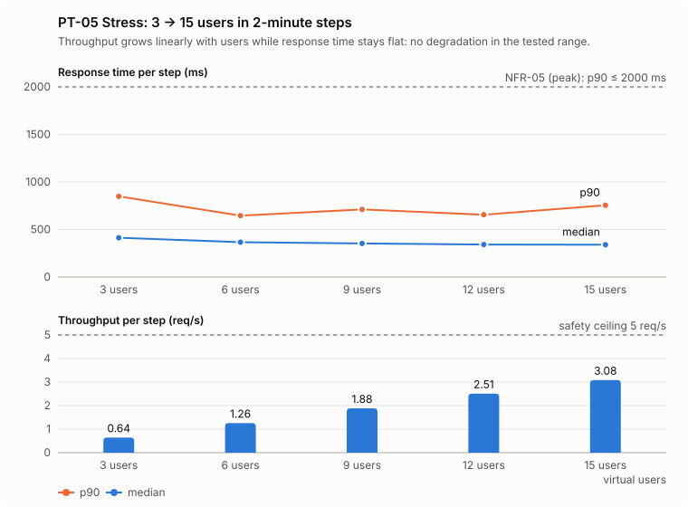

# E-commerce Performance Testing — Beginner's Full Guide

Sep 28, 2026 · @Anusree P

## 1. Start here

This project checks **how fast a shopping website's API stays when many people use it at the same time**. It uses a free tool called **Apache JMeter**, and it tests the free practice website **DummyJSON**.

The result: in all 6 test runs, the website stayed fast and almost never failed, from 1 user up to 15 users at the same time.

**Where the project lives:** [github.com/Anusreepsuresh074/ecommerce-performance-testing](https://github.com/Anusreepsuresh074/ecommerce-performance-testing)

**Who this guide is for:** you, starting from zero. Every word is explained the first time it appears. If you forget one, look it up in the glossary at the end (section 15).

**How to read it:**

1. Sections 2–5 teach the basics: what performance testing is, the website we tested, the tools, and JMeter.
2. Sections 6–9 explain this project: how it was built, every folder and file, every script, and every number.
3. Sections 10–13 show the results, how to run it yourself, how the robot (CI) runs it, and how to reuse it.
4. Section 14 is interview practice: questions with model answers.
5. Section 15 is the glossary, every term A to Z.

**A tip:** read one section a day, and open the real file in the project next to it. Reading the file while the guide explains it is the fastest way to learn it.

### Your to-do list

The project is finished and correct; what's left is for you to understand it and explain it in an interview. Tick each box when it's done. Take about two weeks, one small step a day.

**Week 1: understand the project**

- [ ] Day 1: read sections 1 to 3 (what performance testing is, and the website we tested).
- [ ] Day 2: read section 4 and 5 (the tools and the JMeter script). Keep the JMeter window open next to it: run `jmeter -t test-plans/shopper-journey.jmx` from the project folder, click each element, and never press the green Start button.
- [ ] Day 3: read sections 6 to 8 (the skills, every file, every script).
- [ ] Day 4: read section 9 (the numbers: Little's Law, pacing, 6 users, 1.25 requests per second). Try to work out 6 users on paper yourself.
- [ ] Day 5: read section 10 (the results of all 6 tests). Open the load test dashboard in Chrome: `google-chrome reports/20260928T154706Z-shopper-journey-load/index.html`.
- [ ] Day 6: do it yourself, as in section 11: run `tests/offline/run-offline-checks.sh`, then `scripts/run-scenario.sh smoke`, then `scripts/build-dashboard.sh results/<new run folder>` and open the dashboard.
- [ ] Day 7: read sections 12, 13 and 15 (CI, reusing the project, the glossary).

**Week 2: practise the interview**

- [ ] Day 8: learn questions 1 to 18 (group A, about this project). Say each answer aloud in your own words.
- [ ] Day 9: learn questions 163 to 184 (group K, more about this project).
- [ ] Day 10: learn questions 19 to 37 (group B, performance testing basics).
- [ ] Day 11: learn questions 38 to 49 and 54 to 88 (groups C and E, JMeter).
- [ ] Day 12: learn questions 89 to 108 (group F, reading results) and 50 to 53 (group D).
- [ ] Day 13: learn questions 109 to 162 (groups G to J: strategy, tools, CI, troubleshooting).
- [ ] Day 14: learn questions 185 to 193 (group L), and write your own answers to 183 and 191.
- [ ] Finally: ask Claude to run a practice interview with you, one question at a time.

**The 5 things you must be able to explain without notes:** correlation (the login token), pacing and think time, Little's Law (why 6 users), p90 instead of average, and FAIL versus INVALID.

**After that:** the next project on your roadmap is Postman + Newman, testing the same DummyJSON API.

## 2. Performance testing from zero

**Performance testing checks whether a system stays fast and correct when many people use it at the same time.** Normal testing (functional testing) asks "does it give the right answer?". Performance testing asks "does it still give the right answer, *quickly*, when 1,000 people ask at once?".

### A shop example

Imagine a small shop with one shopkeeper.

- One customer comes in and gets served in 1 minute. That's the **response time**: how long you wait for an answer.
- Now 20 customers come in together. Does each one still wait 1 minute, or 10 minutes? Does the shopkeeper start making mistakes (**errors**)?
- How many customers can the shop serve in an hour? That's **throughput**.

A website is the same. Its "shopkeeper" is a computer called a **server**. Performance testing sends many pretend customers to the server and measures the waiting time, the mistakes and the throughput.

### Why companies do it

- **Slow websites lose money.** People leave a page that takes too long to load.
- **Busy days break things.** A sale, a festival or a news story can bring 10 times more users than normal.
- **Finding it before users do is cheap.** Fixing a slow system after it has crashed in front of customers is very expensive.

### Pretend users: virtual users

We can't ask 1,000 real people to click at the same moment. A tool like **JMeter** creates **virtual users**: small programs that each act like one person, sending the same requests a real person's browser or app would send.

### The test types

```text
Users
  ^
  |  LOAD          ________________        steady, normal users for a while
  |               /                \
  |  STRESS                    ____       more and more users, in steps
  |                       ____|
  |                  ____|
  |             ____|
  |  SPIKE           ____                 normal, a sudden rush, then normal again
  |          ______|    |______
  |  ENDURANCE  __________________________________   normal users for many hours
  +--------------------------------------------------------> Time
```

Each test type answers a different question:

| Test type | Simple meaning | The question it answers | In this project |
| --- | --- | --- | --- |
| **Smoke** | A tiny first check with 1 user | Does the test script work at all? | PT-01: 1 user, 2 rounds |
| **Baseline** | 1 user, many rounds | How fast is it with nobody else around? This is the "normal" to compare with. | PT-02: 1 user, 10 rounds |
| **Load** | A normal busy day | Is it fast enough at the expected number of users? | PT-03: 6 users for 10 minutes, run twice |
| **Stress** | Keep adding users | Where does it start to slow down or break? | PT-05: 3 → 15 users, stopped at a safe limit |
| **Spike** | A sudden rush | Does it survive a jump in users, and recover after? | PT-06: 6 → 15 → 6 users |
| **Endurance (soak)** | Normal load for hours | Does it get slower over time (for example a memory leak)? | Not run: too long for a free public site |

The test IDs skip PT-04 on purpose: that number was kept for the endurance test, which is out of scope.

### The four things we measure

1. **Response time:** how long one request takes, in milliseconds (ms). 1000 ms = 1 second.
2. **Error rate:** what percentage of requests failed.
3. **Throughput:** how many requests per second the system handled.
4. **Percentiles**, especially the **90th percentile (p90)**: sort all response times from fastest to slowest; the p90 is the time that 90% of requests were faster than. It's used instead of the average because an average hides the slow requests that annoy people. Section 9 explains this with numbers.

## 3. The website we tested: DummyJSON

**[DummyJSON](https://dummyjson.com) is a free, fake online shop that gives back practice data to anyone who asks.** Developers and testers use it to practise without needing a real company's system. The same site is tested for correctness in your other project, [ecommerce-api-automation](https://github.com/Anusreepsuresh074/ecommerce-api-automation).

### What an API is, simply

A normal website shows you pages to look at. An **API** (Application Programming Interface) is the part of a website that talks to *programs* instead of people. You send it a **request** ("give me product 7"), and it sends back a **response**, written in **JSON**: a simple text format of names and values, like `{"id": 7, "title": "Laptop"}`.

Each address you can ask is called an **endpoint**. Each request has a **method**: `GET` means "give me something", `POST` means "here is something, do something with it" (like logging in).

Every response comes with a **status code**, a three-digit number:

| Code | Meaning |
| --- | --- |
| 200 | OK, here is your answer |
| 400 | Your request was wrong (for example a bad password) |
| 401 | You're not logged in, or your token is missing |
| 404 | That thing doesn't exist |
| 429 | Too many requests: slow down (the rate limit) |
| 500 | The server itself broke |

### Who made it and how it works

- It was made by one developer (GitHub user [Ovi](https://github.com/Ovi/DummyJSON)) and the code is **open source**, which means anyone can read it.
- It's written in **Node.js** (JavaScript that runs on a server) with a library called **Express**.
- The data (194 products, test users, carts and so on) is kept in the server's **memory**, not in a database, so the server's own work is small and fast.
- "Writes" (adding, changing or deleting a product) are only **pretend**: the site answers as if it saved them, but nothing really changes.
- It sits behind **Cloudflare**, a company whose computers around the world sit in front of websites. Cloudflare can keep a copy of popular answers (a **cache**) and send that copy back without asking the real server.

### The 5 endpoints our test uses

These 5 steps make one **shopper journey**: what a real shopper does, in order.

| Step | Method + endpoint | What it does | What we check came back |
| --- | --- | --- | --- |
| T01 Login | `POST /auth/login` | Send a username and password; get back a **token** (a digital pass) | Status 200 and an `accessToken` |
| T02 Who am I | `GET /auth/me` | Show the token; get back the logged-in user's details | Status 200 and a `username` |
| T03 Browse | `GET /products?limit=30&skip=N` | A page of 30 products, starting after N products | Status 200 and at least one product |
| T04 Search | `GET /products/search?q=phone` | Products whose name or description contains the word | Status 200 and `total` above 0 |
| T05 View product | `GET /products/7` | The full details of one product | Status 200 and the same `id` we asked for |

**The token.** Logging in gives a token called a **JWT** (JSON Web Token): a long string that proves who you are. For `/auth/me`, the token is sent in a **header** (extra information attached to a request) like this: `Authorization: Bearer <token>`. "Bearer" means "whoever carries this pass is allowed in". A token lasts 60 minutes by default.

### Three facts that shaped the whole project

1. **The rate limit: 100 requests every 10 seconds from one computer.** It's not written in the docs. We found it in the site's source code (a file called `rate-limiter.js`), then confirmed it on the live site: every answer carries a header `x-ratelimit-limit: 100`. If you go over, the site answers `429`. All our virtual users run on one computer, so they **share** this limit. That's why our tests stay small: at most about 3 requests per second, 31% of the limit.
2. **The Cloudflare cache.** Plain `/products` and `/products/1` came back from Cloudflare's copy (header `cf-cache-status: HIT`), so they never reached the real server. Testing them would measure Cloudflare, not DummyJSON. So our script asks for varied pages (`skip` changes randomly) and random product numbers, which all reach the real server (`cf-cache-status: DYNAMIC`).
3. **It's a free public service.** Other people use it at the same time as us. Heavy testing would slow it down for them, so every test has safety limits (section 9).

### Test users

DummyJSON publishes a list of fake users at `dummyjson.com/users`, each with a username and password anyone may use. Our project uses one of them. Its name and password are kept in a private file (`.env`), never in the project's code or reports.

## 4. The tools

**JMeter does the load testing; everything else helps prepare, run, check and share it.**

| Tool | What it is, simply | Why this project uses it |
| --- | --- | --- |
| **Apache JMeter 5.6.3** | A free program from the Apache Software Foundation that pretends to be many users and records every answer and its timing | The industry's most common open-source load testing tool; it builds and runs our test (section 5) |
| **Java 21** | The language JMeter is written in; JMeter needs it installed to run | Installed on the computer and on the CI robot |
| **Bash** | The command language of the Linux terminal; a `.sh` file is a list of Bash commands | The scripts that run a test end to end (`run-test.sh`, `run-scenario.sh`, `precheck.sh`) |
| **Python 3.12** | A popular, easy-to-read programming language | The scripts that judge results, draw charts and check files (`evaluate-run.py` and others). Only Python's built-in parts are used, so nothing extra needs installing. |
| **curl** | A tiny command-line tool that sends one request to a website | The first research: one-at-a-time requests to measure a single user's speed, and the pre-run check |
| **Git** | A tool that saves every version of every file, like "track changes" for a whole folder | Keeps the project's history; each saved version is a **commit** |
| **GitHub** | A website that stores Git projects online (**repositories**, or repos) | Where the project is shown to interviewers |
| **GitHub Actions** | GitHub's robot that runs commands every time you push new code: **CI** (Continuous Integration) | Runs lint checks, the offline checks and a live smoke test on every push (section 12) |
| **GitHub Pages** | Free website hosting from a GitHub repo | Publishes the JMeter HTML dashboards |
| **ruff** | A Python **linter**: a program that reads code and points out mistakes and messy style | Keeps the Python scripts clean; runs in CI |
| **shellcheck** | The same thing for Bash scripts | Keeps the shell scripts safe; runs in CI |
| **Claude Code skills** | Written instruction files ("recipes") that tell the AI assistant Claude how to do one job, step by step, with rules | Every part of the project was made by running 8 of your own skills in order (section 6) |

### JMeter's two faces: GUI and non-GUI

- **GUI mode** (Graphical User Interface) is the window with buttons and a tree of elements. You use it to **build and read** a test. You open it by typing `jmeter` in a terminal.
- **Non-GUI mode** (command-line mode, `jmeter -n`) has no window. You use it to **run real load**. The GUI itself uses a lot of memory and processor time, which would slow the computer and make the results wrong. Running real tests from the GUI is a classic beginner mistake.

This project always runs tests in non-GUI mode through `scripts/run-test.sh`.

### Where JMeter is installed on your computer

- Folder: `~/tools/apache-jmeter-5.6.3` (`~` means your home folder, `/home/anusree`).
- It was downloaded from Apache's official site, and its **SHA-512 checksum** was checked. A checksum is a fingerprint of the file; if it matches the official one, the file wasn't damaged or tampered with.
- Its `bin` folder was added to your **PATH** (the list of folders the terminal searches for commands) in `~/.bashrc`, so `jmeter` works from any folder.

## 5. JMeter explained, element by element

**A JMeter test is a tree of "elements", saved in one `.jmx` file; ours is `test-plans/shopper-journey.jmx`.** Each element has one job. The drawing shows our tree; the table below explains every kind of element in it.

```text
DummyJSON Shopper Journey (Test Plan: username/password from environment variables)
├── HTTP Request Defaults        server address, 10 s connect / 30 s response timeouts
├── Common headers               Accept, Accept-Encoding, User-Agent
├── Search terms (CSV)           data/search-terms.csv -> ${term}
├── Shopper Journey (Test Fragment: written once)
│   ├── Pacing (Flow Control Action + JSR223 Timer: one journey every 24 s per user)
│   └── Journey T01-T05 (Simple Controller)
│       ├── Safety ceiling       Constant Throughput Timer, max 5 req/s for all users
│       ├── Record cf-cache-status / x-ratelimit-remaining (Regex Extractors)
│       ├── Stop test on 429     JSR223 PostProcessor
│       ├── T01_Login            POST /auth/login -> extract accessToken; assert 200 + token
│       ├── T02_Get_Current_User GET /auth/me with Bearer token; assert 200 + username
│       ├── T03_Browse_Products  GET /products?limit=30&skip=<random>; assert 200 + a product
│       ├── T04_Search_Products  GET /products/search?q=${term} -> extract random productId
│       └── T05_View_Product     GET /products/${productId}; assert 200 + id matches
│           (T02-T05 each have a 2-4 s Uniform Random Timer: think time)
└── TG1 ... TG5 (Thread Groups: users, ramp-up, delay, duration from config/profiles/)
    └── Run Shopper Journey (Module Controller -> the Test Fragment)
```

The journey is written **once** (in the Test Fragment), and each Thread Group runs it through a Module Controller. That's why the same script can be a smoke test, a load test or a spike test: only the numbers in the profile file change.

### Every element type we use

| Element (JMeter family) | What it does, simply | In our script |
| --- | --- | --- |
| **Test Plan** | The top of the tree; holds everything | "DummyJSON Shopper Journey" |
| **User Defined Variables** | Named values the whole test can use, set once at the start | `username` and `password`, read from environment variables with `${__groovy(System.getenv('AUTH_USERNAME'))}` |
| **HTTP Request Defaults** (config element) | Settings every request inherits, so you don't repeat them | The website address from `${__P(host)}`, HTTPS, 10 s connect timeout, 30 s response timeout |
| **HTTP Header Manager** (config element) | Extra headers added to requests | `Accept: application/json`, `Accept-Encoding: gzip`, and a `User-Agent` that says who we are; a second one adds `Authorization: Bearer <token>` to T02 only |
| **CSV Data Set Config** (config element) | Reads test data from a CSV file, one row per loop | `data/search-terms.csv` → the variable `${term}` |
| **Thread Group** | A group of virtual users (**threads**); sets how many, how fast they start (**ramp-up**), when (**delay**) and for how long (**duration**) | TG1–TG5, every number read from the profile with `${__P(tg1.threads,0)}` and similar |
| **Test Fragment** | A reusable piece of the tree that does nothing on its own | The shopper journey, T01–T05 |
| **Module Controller** (logic controller) | "Run that fragment here" | Inside each Thread Group |
| **Simple Controller** (logic controller) | A folder that groups elements so settings apply to all of them | "Journey T01–T05" |
| **HTTP Request** (**sampler**) | Sends one request and records the answer. Each sampler becomes one row in the results. | The 5 transactions `T01_Login` … `T05_View_Product` |
| **JSON Extractor** (post-processor) | Reads a value out of a JSON answer into a variable. Reusing it in the next request is called **correlation**. | `accessToken` from the login answer; a random `productId` from the search answer |
| **Regular Expression Extractor** (post-processor) | Reads a value using a text pattern | The `cf-cache-status` and `x-ratelimit-remaining` headers, saved into the results |
| **JSR223 PostProcessor** (post-processor) | A small Groovy program that runs after a request | Stops the whole test if an answer is `429` |
| **Response Assertion** (assertion) | Checks the answer; if the check fails, the sample is marked failed | Status code must be 200 |
| **JSON Assertion** (assertion) | Checks a value inside the JSON | For example `$.accessToken` must exist, or `$.id` must equal the product we asked for |
| **Uniform Random Timer** (timer) | Waits a random time before a request: **think time** | 2–4 seconds before T02–T05 |
| **Flow Control Action + JSR223 Timer** | Waits at the start of each loop until the user's next time slot: **pacing** | One new journey every 24 s per user |
| **Constant Throughput Timer** (timer) | Slows requests down so the total rate never goes above a number | Safety ceiling: 300 requests per minute (5 per second) for all users together |

### Words from the table

- **`${...}`**: JMeter's way of saying "put a value here". `${term}` is a variable; `${__P(host)}` reads a **property** passed in from a file; `${__groovy(...)}` runs a tiny Groovy program.
- **Groovy**: a scripting language that runs inside JMeter (like Java, but shorter).
- **JSONPath**: a way to point at a value inside JSON. `$.accessToken` means "the `accessToken` field at the top"; `$.products[*].id` means "the `id` of every product in the list".
- **Listener**: an element that shows or saves results (for example "View Results Tree"). Our script has **none on purpose**: they slow JMeter down and could save passwords and tokens. Results go to a file instead.

### What we did NOT add, and why

- **No HTTP Cookie Manager.** Login also sets the token as a **cookie** (a small value the browser keeps and sends back automatically). DummyJSON accepts that cookie as a login too. A Cookie Manager would send it silently, so `/auth/me` could pass even if our Bearer header were broken. Leaving it out makes the test honest.
- **No plugins.** Everything is core JMeter, so any computer (and the CI robot) can run it without installing extras.

## 6. How the project was built: the life cycle and the 8 skills

**QA teams follow a fixed order for performance testing, the Performance Testing Life Cycle (PTLC); this project follows it, one skill per phase.**

### What a skill is

A **skill** is a written recipe for the AI assistant: "read these files, follow these steps, obey these rules, write this output". Each lives in `skills/<name>/SKILL.md` and is plain English you can read. Because the steps and rules are written down, the result is the same every time, and the same skill works on the next API with no changes.

Every skill file has the same parts:

- **description** (at the top): one paragraph saying when to use it.
- **When to use:** the situations it's for.
- **Guardrails:** hard rules it must never break, for example "no load without an approved plan", "no password in any file", "every number needs a source or is labelled an assumption".
- **Steps:** what to do, in order.
- **Output template:** the exact shape of the file it writes.
- **Limitations:** jobs it must leave to other skills.

```text
1. create-perf-structure -> 2. get-perf-context -> 3. get-perf-auth -> 4. perf-test-design (STOP: human approval)
   -> 5. jmeter-test-plan -> 6. run-perf-test -> 7. perf-report -> 8. perf-ci-integration
```

The **agent** file, `agents/perf-automation-agent.md`, is the "manager": it lists the skills and their order. It's a **template**: to use it on a new project, you copy it and fill in the project's details.

### The 8 skills, one by one

| # | Skill | PTLC phase | What it does, simply | What it produced here |
| --- | --- | --- | --- | --- |
| 1 | `create-perf-structure` | Setup | Builds the empty "cupboard": folders, the address file, the one script that runs JMeter, the README. Asks about the tool version and environments first. | `config/env/prod.properties`, `scripts/run-test.sh`, the folder READMEs |
| 2 | `get-perf-context` | Requirement gathering | Researches the API: its endpoints, realistic user journeys, stated speed targets, usage limits, caching, test data, and a tiny one-user timing. Answers the standard **NFR questionnaire**. Never sends load. | `context/perf-context.md`, including the rate limit found in DummyJSON's source code |
| 3 | `get-perf-auth` | Requirement gathering | Works out how each virtual user logs in, takes its token and sends it on, and how passwords reach JMeter without appearing in logs. | `context/perf-auth.md`, and the variable names in `.env.example` |
| 4 | `perf-test-design` | Planning and workload modelling | Writes the formal **Performance Test Plan**: scope, SLAs, the workload model, scenarios, rules, risks. Then **stops** for a human to sign off. | `context/perf-test-plan.md` v1.0, approved |
| 5 | `jmeter-test-plan` | Script development | Builds the JMeter script, one load profile per scenario, and the test data, from the approved plan only. Tests the script against a fake local copy of the API before touching the real one. | `test-plans/shopper-journey.jmx`, `config/profiles/*`, `data/search-terms.csv`, `tests/offline/` |
| 6 | `run-perf-test` | Test execution | Runs the scenarios in the plan's order, checks the safety caps and the free budget before each run, and judges every run: **PASS**, **FAIL**, **INVALID** or **VALID**. | `config/nfr.json`, the execution scripts, one `summary.md` per run |
| 7 | `perf-report` | Analysis and reporting | Builds JMeter's HTML dashboards, the charts, the evidence folder and the **Test Summary Report**. | `docs/test-summary-report.md`, `docs/images/`, `docs/evidence/` |
| 8 | `perf-ci-integration` | Continuous testing | Makes GitHub run the checks and a live smoke test on every push, following the plan's CI rules. | `.github/workflows/perf.yml` |

### How the work actually went (the real story)

1. The skills were written and run one at a time; after each one you saw the result.
2. Skill 2 found the hidden rate limit and the Cloudflare cache. Both changed the plan: smaller tests, and random pages so the real server is measured.
3. You asked for the standard QA way, so the plan was rewritten (version 0.2) into the standard layout, with a workload model, a baseline test and 90th-percentile SLAs. You signed off version 1.0.
4. The script was built and checked offline against the stub (37 checks), then the real runs went: smoke, baseline, load twice, stress, spike.
5. The report was written, then an independent review of every file found mistakes (for example, repeatability was judged on the wrong time window). They were fixed before pushing to GitHub.

### Why skills are worth it

- **Repeatable:** the same steps and rules every time, not a one-off script.
- **Reusable:** nothing in a skill mentions DummyJSON; the project-specific facts live in `context/` and `config/`.
- **Safe:** the guardrails stop the classic mistakes: testing without a plan, going over a rate limit, leaking a password, inventing numbers.
- **Honest:** every number in the plan has a source or says `[Assumption]`, and every run's verdict comes from its data.

## 7. Every folder and file, explained

**The project has 55 files in 14 folders; each has one job.** Two more folders, `results/` and `reports/`, exist only on your computer: they hold the raw run data and dashboards, which are too big (and change too often) to save on GitHub.

### The top level

| File | What it is |
| --- | --- |
| `README.md` | The front page on GitHub: what the project demonstrates, the results, the workload, the SLAs, the key decisions, how to run it. The first thing an interviewer reads. |
| `.gitignore` | A list of what Git must **never** save: `results/`, `reports/`, `*.jtl`, `jmeter.log`, `.env` (the password file), `.claude/`, editor folders, Python caches. |
| `.env.example` | A template for the private `.env` file. It lists the **names** `AUTH_USERNAME=` and `AUTH_PASSWORD=` with empty values. You copy it to `.env` and fill in a DummyJSON test user. |
| `.env` (not on GitHub) | Your real test username and password. Only ever on your computer. |
| `pyproject.toml` | Settings for **ruff**, the Python checker: lines up to 120 characters, Python 3.12, and which rule groups to check (E, F, I, B, UP, SIM: errors, style, imports, likely bugs, modern syntax, simpler code). |
| `.pre-commit-config.yaml` | Checks that can run automatically before each commit: ruff, shellcheck, no trailing spaces, valid YAML, JSON and XML, and "no private key accidentally added". |

### `context/`: the thinking documents

| File | What it is |
| --- | --- |
| `perf-context.md` | **Requirement gathering** (skill 2). Sources used; the 7 endpoints considered; the user journeys; the **NFR questionnaire** (11 standard questions: expected users? SLA? error rate? monitoring? and so on; most answers are "not stated"); the limits, each with an ID like `LIMIT-rate-100-per-10s`; environment facts (Cloudflare, in-memory data); test-data facts (194 products, `phone` finds 23); the one-user `curl` baseline (medians 618–839 ms); risks; open questions. |
| `perf-auth.md` | **How virtual users log in** (skill 3). The login request shape; the token flow table (where the token comes from, the JSON Extractor, why each user keeps its own copy, the header, what happens on failure, why no Cookie Manager); login frequency (every loop); how passwords reach JMeter (environment variables, never `-J`, which JMeter writes into its log); what must never be saved. |
| `perf-test-plan.md` | **The Performance Test Plan** (skill 4), 18 sections: document control (versions and sign-off); objectives; scope in and out; application overview; the 7 **NFRs** (SLAs); the **workload model** (transactions, pacing, Little's Law); the 5 scenarios PT-01…PT-06; environment; tools; test data; metrics and monitoring; entry, exit, suspension and resumption criteria; safety caps; risks; assumptions; deliverables; schedule; sign-off questions. |

### `test-plans/`: the JMeter script

| File | What it is |
| --- | --- |
| `shopper-journey.jmx` | The JMeter test itself, 549 lines of XML (a text format of nested tags, like `<HTTPSamplerProxy testname="T01_Login">`). Section 5 explains every element. Open it in the JMeter GUI to see it as a tree. |
| `README.md` | A picture of the script's tree in text, and why it's built that way. |

### `config/`: the settings

| File | What it is, line by line |
| --- | --- |
| `env/prod.properties` | The website's address. `protocol=https` and `host=dummyjson.com`. The script reads them as `${__P(protocol)}` and `${__P(host)}`. To test a different site you change only this file. |
| `profiles/smoke.properties` | PT-01: `tg1.threads=1` (1 user), `tg1.loops=2` (2 journeys), `tg1.duration=120` (a time cap only). |
| `profiles/baseline.properties` | PT-02: 1 user, `tg1.loops=10`, cap 300 s. |
| `profiles/load.properties` | PT-03: `tg1.threads=6`, `tg1.rampup=60` (start the 6 users over 60 s), `tg1.loops=-1` (loop forever…), `tg1.duration=660` (…until 660 s = 11 min). |
| `profiles/stress.properties` | PT-05: five thread groups of 3 users each; `tg2.delay=120`, `tg3.delay=240` and so on start each group 2 minutes later; durations 600, 480, 360, 240, 120 s make them all end together at 600 s. That's how 3 → 6 → 9 → 12 → 15 users is built without plugins. |
| `profiles/spike.properties` | PT-06: `tg1` = 6 users for 420 s; `tg2` = 9 extra users starting at 120 s (`tg2.delay=120`), all within 10 s (`tg2.rampup=10`), for 120 s. |
| All profiles also have | `pacing.ms=24000` (one journey every 24 s per user), `think.min.ms=2000` and `think.range.ms=2000` (think time 2 s plus up to 2 s random). |
| `profiles/README.md` | A table of the five profiles and the rule: numbers come only from the approved plan. |
| `jmeter-common.properties` | Settings for **every** run. `sample_variables=cacheStatus,rateLimitRemaining` adds two columns to the results. `...response_data=false`, `...samplerData=false`, `...requestHeaders=false` and `...responseHeaders=false`: never save what was sent or received (tokens live there). `...output_format=csv`: results as a spreadsheet-like file. `summariser.interval=30`: print progress every 30 s. `safety.max.samples.per.min=300`: the 5 requests-per-second ceiling. |
| `nfr.json` | The plan's SLAs in a form a program can read. `caps`: max 15 users, 900 s, 5 req/s, 80% CPU, at least 80 of 100 rate-limit budget free, 120 s between runs, suspend at 10% errors for 60 s, at most 3 load, stress or spike runs per day. `scenarios`: for each test, its ID, its time windows (for example load's steady state is 60–660 s) and its checks (for example `NFR-01`, metric `p90`, per transaction, window 60–660 s, `<=` 1500). |
| `report.properties` | Dashboard settings: Apdex satisfied 1500 ms and tolerated 6000 ms; percentile columns 90, 95 and 99; graph points every 10 s; show only T01–T05. |

### `data/`

| File | What it is |
| --- | --- |
| `search-terms.csv` | A header line `term`, then 9 words: phone, laptop, watch, shirt, chair, lipstick, sunglasses, bag, apple. Each was checked to return at least 1 product; `perfume` returned 0 and was removed. |
| `README.md` | What belongs here, and the rule: never secrets. |

### `scripts/`: the programs (section 8 explains each step by step)

| File | One-line job |
| --- | --- |
| `run-test.sh` | The single way JMeter is started: non-GUI, with the common, env and profile files, into a new timestamped results folder. |
| `run-scenario.sh` | One scenario end to end: caps and run rules → pre-run check → `run-test.sh` while measuring CPU → verdict. |
| `check-caps.py` | Refuses a profile over the caps, or a run too soon after the last one, or over the daily limit. |
| `precheck.sh` | Sends one request and checks the rate-limit budget is at least 80 of 100 free. |
| `evaluate-run.py` | Reads a run's results and judges it against `nfr.json`: PASS, FAIL, INVALID or VALID. |
| `build-dashboard.sh` | Builds JMeter's HTML dashboard for one run. |
| `build-report-data.py` | Collects every run's summary into the analysis tables, and copies them into `docs/evidence/`. |
| `build-charts.py` | Draws the three report charts as SVG pictures from the raw results. |

### `tests/offline/`: testing the test

| File | What it is |
| --- | --- |
| `stub_server.py` | A **stub**: a tiny fake DummyJSON that runs on your own computer. It answers like the real site and writes down what the script sent (whether a token or cookie was present, never its value). It can also pretend to have no token, or to send a `429`. |
| `check-offline.py` | The 37 checks: every sample passed; the token went only to `/auth/me`; no cookie was ever sent; exactly 2 journeys; the search words rotate; the product id came from the search; pacing held; a missing token was caught; a `429` stopped the test; each profile reached the right number of users; no password appeared anywhere. |
| `run-offline-checks.sh` | Runs 6 cases against the stub with shortened timings (about 2 minutes) and reports PASS or FAIL. No request leaves your computer. |

### `docs/`: the results

| File | What it is |
| --- | --- |
| `test-summary-report.md` | The **Test Summary Report**: executive summary, runs, SLA compliance, detailed results, observations, bottlenecks, recommendations, deviations, limitations. |
| `evidence/*.md` | One verdict summary per run (6 files), plus `analysis.md` with every table the report uses. |
| `images/*.svg` | The three charts: load repeatability, the stress trend and the spike timeline. |

### The rest

| Folder or file | What it is |
| --- | --- |
| `skills/<name>/SKILL.md` (8 files) | The 8 recipes (section 6). |
| `agents/perf-automation-agent.md` | The manager template that lists the skill order. |
| `.github/workflows/perf.yml` | The CI robot's instructions (section 12). |
| `.github/dependabot.yml` | Asks GitHub's **Dependabot** to check weekly for newer versions of the CI actions and open an update request. |
| `results/<UTC time>-shopper-journey-<scenario>/` (your computer only) | One folder per run: `results.jtl` (one line per request: time, how long, status, success, bytes, connect time, cache status, rate-limit remaining), `jmeter.log`, `injector-cpu.csv` (your CPU every 5 s), `summary.json` and `summary.md`. |
| `reports/<run>/` (your computer only) | The JMeter HTML dashboard for that run: open `index.html` in a browser. |

## 8. Every script, step by step

**You normally run just one script, `scripts/run-scenario.sh <scenario>`; it calls the others in this order.**

1. `check-caps.py` — is this run allowed?
2. `precheck.sh` — is the website ready and is there budget free?
3. `run-test.sh` — run JMeter (while a small helper measures your CPU).
4. `evaluate-run.py` — judge the result.

Afterwards you can run `build-dashboard.sh`, `build-report-data.py` and `build-charts.py` to make the reports.

An **exit code** is the number a program gives back when it ends: `0` means OK, anything else means something to look at. Our scripts use them so CI can tell PASS from FAIL.

### `run-scenario.sh <scenario>` (the one you run)

1. Runs `check-caps.py <scenario>`. If refused, it stops with exit code 3 ("not started").
2. Runs `precheck.sh`. If the budget isn't free, it stops with exit code 3.
3. Starts a tiny Python helper that reads `/proc/stat` (the Linux file that counts how busy the processor is) every 5 seconds and writes "time, CPU used %" lines.
4. Runs `run-test.sh shopper-journey <scenario>` and shows its output.
5. Stops the CPU helper and moves its file into the run folder as `injector-cpu.csv`. (The **injector** or **load generator** is the computer sending the load: yours.)
6. Runs `evaluate-run.py` and ends with its exit code: `0` PASS (or VALID), `1` FAIL, `2` INVALID.

### `check-caps.py <profile>`

1. Reads the profile file and adds up every `tgN.threads`: the total users.
2. For each thread group, `delay + duration` is when it ends; the biggest is when the run ends.
3. Compares them with the caps in `nfr.json`: at most 15 users, at most 900 s.
4. Looks in `results/`: if the last run ended less than 120 s ago, refused (the plan's gap rule).
5. Counts today's runs of this scenario (UTC date in the folder name): load, stress and spike are limited to 3 per day.
6. Prints "Caps OK … run rules OK" (exit 0) or "REFUSED … and why" (exit 1).

### `precheck.sh [env]`

1. Reads `host` and `protocol` from `config/env/prod.properties`.
2. Sends **one** request to `/products/search?q=phone&limit=1&select=id`. This address has a query string, so Cloudflare passes it to the real server and the rate-limit header is live (a cached answer would carry an old copy of the header).
3. Reads three headers: the status, `x-ratelimit-remaining` and `cf-cache-status`.
4. GO if the status is 200 and at least 80 of the 100 requests are still free; otherwise NO GO (exit 1).

### `run-test.sh <plan> <profile> [env]`

1. Checks JMeter is installed and that the 4 files exist: the common settings, the `.jmx`, the profile and the env file.
2. Loads `.env` as **environment variables** (values the operating system hands to a program) with `set -a; source .env`. Nothing is printed.
3. Makes a new folder `results/<UTC time>-<plan>-<profile>/`, for example `results/20260928T153403Z-shopper-journey-load/`. The `T` separates date and time and the `Z` means UTC. It refuses to overwrite an existing folder.
4. Runs `jmeter -n -t <plan> -q <common> -q <env> -q <profile> -l results.jtl -j jmeter.log`: `-n` non-GUI, `-t` the test, `-q` extra property files, `-l` the results file, `-j` the log file.
5. Prints `RUN_DIR=…` so the next script knows where the results are.

### `evaluate-run.py <run dir> <scenario>`

1. Reads `results.jtl`: one row per request with its start time, **elapsed** time (the full response time), status, success, cache status and rate-limit remaining.
2. Works out, per transaction and overall: samples, errors, error %, average, **median** (the middle value), min, max, **p90**, **p95**, **p99** and throughput.
3. It uses the same percentile formula as JMeter's dashboard (Commons Math "legacy": position = p × (n + 1) ÷ 100), so both always show the same numbers. We checked: all 6 dashboards matched exactly.
4. For load, it also works out the **steady state**: 60–660 s, after the ramp-up.
5. Runs every check in `nfr.json` for this scenario, each on its own time window.
6. Checks the **validity rules**: any `429`, CPU over 80% for 15 s, errors over 10% for 60 s, or throughput over 5 req/s makes the run **INVALID**.
7. Decides the verdict: INVALID, or VALID (a run with no checks, the baseline), or PASS (every check met), or FAIL.
8. Writes `summary.json` (for programs) and `summary.md` (for people).

### `build-dashboard.sh <run dir>`

Runs `jmeter -g results.jtl -o reports/<run>/` (`-g` make a report from this results file, `-o` put it here) with `report.properties`. The result is JMeter's standard HTML dashboard: summary tables, Apdex, response times over time, throughput, errors and percentiles.

### `build-report-data.py [--evidence]`

Reads every `results/*/summary.json` and writes `reports/analysis.md`: the runs table, every SLA check, a table per run, **load vs baseline** (how many times slower) and **repeatability** (do the two load runs agree within 10%?). With `--evidence`, it also copies each run's `summary.md` and the analysis into `docs/evidence/`.

### `build-charts.py <load 1> <load 2> <stress> <spike>`

Draws `docs/images/*.svg` straight from the raw results: p90 every 60 s for both load runs, median and p90 per stress step with throughput per step, and p90 every 20 s for the spike with the number of active users. Each chart has one y-axis per panel, SLA lines drawn dashed, and colours checked to be safe for colour-blind readers.

### The offline scripts (`tests/offline/`)

`run-offline-checks.sh` starts `stub_server.py` on your computer at `127.0.0.1:18089` (`127.0.0.1` means "this computer"). It runs the real `.jmx` against it 6 times (smoke journey, no token, 429, and the load, stress and spike shapes, sped up), then runs `check-offline.py` on each. Fake credentials are used and checked not to leak.

## 9. The numbers, worked out slowly

**Every number in the plan comes from one of three places: a measured fact, the rate limit, or a labelled assumption.** Here is how each was worked out.

### Step 1: the budget (how much load is allowed)

- DummyJSON allows **100 requests per 10 seconds** from one computer = **10 requests per second**.
- The plan keeps **at least 50% free** for other people and safety, so the hard **ceiling** is 5 requests per second. JMeter's Constant Throughput Timer enforces it: 5 × 60 = **300 requests per minute**.
- The biggest test we planned uses about **3.1 requests per second: 31%** of the limit.

### Step 2: think time and pacing

- **Think time** = the pause between steps, like a person reading the screen. Ours is 2–4 s (2 s plus a random 0–2 s), about 3 s on average. There are 4 pauses in a journey (before steps 2, 3, 4 and 5): about 12 s.
- **Response time** (R) for the 5 steps together, from the one-user baseline: about 3.8 s.
- One journey therefore takes about 3.8 + 12 = 15.8 s.
- **Pacing** = how often a user *starts* a new journey. Ours is **every 24 s**. After a 15.8 s journey the user waits about 8.2 s, then starts the next. Pacing keeps the load steady even if the website becomes faster or slower. It holds as long as the average step takes under 2.4 s.

### Step 3: requests per user

Each user makes 5 requests every 24 seconds:

```latex
\frac{5 \text{ requests}}{24 \text{ s}} \approx 0.208 \text{ requests per second per user}
```

### Step 4: how many users (Little's Law)

**Little's Law** is a simple rule from queueing maths used by every performance tester: the number of users busy in a system equals the arrival rate times how long each one stays.

```latex
N = X \times (R + Z)
```

N = number of users; X = journeys started per second; R = response time; Z = think time. With pacing, (R + Z) is replaced by the pacing time:

```latex
N = X \times \text{pacing}
```

| Load level | Journeys per hour | X (per second) | Users N = X × 24 s | Requests per second | Share of the limit |
| --- | --- | --- | --- | --- | --- |
| Normal (100%) | 900 | 0.25 | **6** | 1.25 | 12.5% |
| Peak (200%) | 1,800 | 0.50 | **12** | 2.50 | 25% |
| Stress top (250%) | 2,250 | 0.625 | **15** | 3.13 | 31% |

"900 journeys per hour" is an **assumption** (DummyJSON doesn't say how busy it normally is). It was chosen to use only one-eighth of the limit. Peak at 200% and stress to 250% are standard multiples.

### Step 5: the SLAs, and what the words mean

- **NFR** (Non-Functional Requirement) = a rule about *how well* a system works (speed, reliability), not *what* it does.
- **SLA** (Service Level Agreement) = a promised target, for example "90% of requests within 1.5 s". In this project the words NFR and SLA mean the same targets.
- DummyJSON has no SLA, so ours are **assumed SLAs, signed off by you**, set from the `curl` baseline (medians 618–839 ms, max 1403 ms).

| ID | Rule | Why this number |
| --- | --- | --- |
| NFR-01 | p90 ≤ 1500 ms per transaction at normal load | About 1.8× the slowest baseline median |
| NFR-02 | Average ≤ 1000 ms per transaction at normal load | About 1.2× the slowest baseline median |
| NFR-03 | Error rate < 1% at normal load | A common QA default |
| NFR-04 | Throughput within ±10% of 1.25 req/s | Proves the workload model was really delivered |
| NFR-05 | At peak: p90 ≤ 2000 ms, errors < 2% | Some slowdown is acceptable at peak |
| NFR-06 | After a spike, p90 back within 1.2× the pre-spike value | "Recovered" means within 20% of before |
| NFR-07 | Zero `429` responses | A `429` means *our* test was too heavy, so the run doesn't count |

### What a percentile is, with a tiny example

Imagine 10 requests took (in ms, sorted): 300, 310, 320, 330, 340, 350, 360, 380, **900**, 1400.

- The **average** is 499 ms. It looks fine, but it hides the two slow ones.
- The **median** (p50) is 345 ms: half were faster.
- The **p90** is about 1350 ms: 90% of requests were faster than this. It shows what the unlucky 1 in 10 users feels.

That's why SLAs use the p90 (JMeter calls it the "90% Line"). The p95 and p99 show the slowest 5% and 1%.

### Safety caps and run rules

| Rule | Value |
| --- | --- |
| Max users in any test | 15 |
| Max length of one run | 15 minutes |
| Max throughput | 5 requests per second |
| Automatic stop | the first `429` |
| Before every run | at least 80 of the 100-request budget free |
| Between runs | at least 2 minutes; never two at once |
| Per day | at most 3 runs each of load, stress and spike |
| Your computer's CPU | must stay under 80%, or the run doesn't count |

## 10. The test runs and what we found

**All 6 runs were valid, and every run with SLA checks passed them: 3,523 requests, 1 error, 0 rate-limit responses.** All ran on 28 September 2026 (times in UTC), in the plan's order, at least 2 minutes apart.

| Run | Test | Users | What happened | Verdict |
| --- | --- | --- | --- | --- |
| 15:25 | PT-01 Smoke | 1 | 10 requests, all correct | PASS |
| 15:28 | PT-02 Baseline | 1 | 50 requests; medians 300–406 ms per step | VALID (reference, no checks) |
| 15:34 | PT-03 Load, run 1 | 6 | Worst p90 714 ms (target 1500), 0 errors in steady state, 1.252 req/s | PASS |
| 15:47 | PT-03 Load, run 2 | 6 | Worst p90 757 ms, 0 errors in steady state, 1 timeout just before it | PASS |
| 16:00 | PT-05 Stress | 3 → 15 | p90 at 12 users 796 ms at worst (target 2000); 0 errors | PASS |
| 16:12 | PT-06 Spike | 6 → 15 → 6 | p90 564 ms before, 560 ms during, 495 ms after | PASS |

### Verdict words

- **PASS:** a valid run that met every check.
- **FAIL:** a valid run that broke at least one SLA.
- **INVALID:** the run can't be trusted (a `429`, your CPU over 80%, or more than 10% errors for a minute), so it says nothing about the website.
- **VALID:** a reference run with no checks. The baseline is recorded to compare against, not to pass or fail.

### The stress test: no slowdown



As users went from 3 to 15, the requests per second grew in a straight line, just as the workload model predicted (0.208 per user), and the response time didn't go up. The highest p90 was at the *first* step: the first minutes include setting up new connections (**warm-up**).

### The spike: no damage

When 9 extra users arrived within 10 seconds, the p90 stayed at about 560 ms. Straight after the spike, the next 20-second window was already back to normal (661 ms, under the limit of 677 ms). That's the **time to recover**: under 20 seconds.

### Four findings, in simple words

1. **One timeout.** In load run 2, one `/auth/me` request got no answer for 30 seconds, so JMeter gave up (a **socket timeout**). It happened once in 3,523 requests (0.03%). It started 3.8 s before the measured window, so the steady-state error rate is 0%, but the whole run shows 0.13%. Both numbers are reported, so nothing is hidden. Your functional project saw a similar one-off dropped connection the day before.
2. **The two load runs didn't fully match (repeatability).** Their **medians** agreed within 7%, but their **p90s** differed by up to 40% (T04: 498 vs 695 ms), so 3 of 5 transactions missed the plan's 10% rule. The cause: run 2 caught a few more slow answers (1.5–2.6 s) from the internet. With about 150 requests per transaction, the p90 is the 15th-slowest one, so a few extra slow answers move it a lot.
3. **The SLAs were too easy.** They were set from the first `curl` baseline, which opened a new secure connection for every request (about 0.6–0.8 s). JMeter reuses connections, so its answers took only 0.3–0.4 s. The report recommends stricter targets next time, for example p90 ≤ 1000 ms.
4. **No bottleneck up to 15 users.** A **bottleneck** is the slowest part that limits everything. None appeared. We couldn't look for its limit, because the rate limit stops a single computer long before the server's real limit.

### The same tests from GitHub's computers (CI)

After the push, the CI robot ran a live smoke test and a load test from GitHub's own servers.

| Run (UTC) | Test | Result | p90, worst transaction | Errors |
| --- | --- | --- | --- | --- |
| 28 Sep, CI | PT-01 Smoke | PASS | — | 0 |
| 28 Sep 18:09, CI | PT-03 Load | PASS | 303 ms (T01), target 1500 | 1 in 797 (0.13%): a dropped connection on one login |

Two lessons from this:

1. **The same test, run from a different place, gives different numbers.** From GitHub's data centre the answers were 2–5× faster (p90 122–303 ms instead of 498–757 ms from your computer), because GitHub's network sits very close to Cloudflare. That's why the plan says to compare only runs from the same place.
2. **The rare network hiccup happened again.** A `SocketException` (the connection was dropped) after 63 ms, once in 797 requests. Together with the earlier timeout, that's about 2 in 4,300 requests. It's a pattern worth watching, but far under the 1% error limit.

### Where to see it all

- The full report: `docs/test-summary-report.md`, with three charts.
- The evidence behind every number: `docs/evidence/`.
- The interactive JMeter dashboards: `reports/<run>/index.html` on your computer, and the smoke and load dashboards on GitHub Pages.

## 11. How to run it yourself

**On your computer everything is already installed; you only need a terminal and the commands below.** On a new computer, start at step 1.

### 1. Install (new computer only)

1. **Java 17 or newer:** `sudo apt install openjdk-21-jre` on Ubuntu. Check it with `java -version`.
2. **JMeter 5.6.3:** download `apache-jmeter-5.6.3.tgz` from [jmeter.apache.org](https://jmeter.apache.org/download_jmeter.cgi), unpack it (`tar xzf apache-jmeter-5.6.3.tgz`), and add its `bin` folder to your PATH in `~/.bashrc`:

   ```
   export JMETER_HOME="$HOME/tools/apache-jmeter-5.6.3"
   export PATH="$JMETER_HOME/bin:$PATH"
   ```

   Open a new terminal and check it with `jmeter --version`.
3. **Get the project:** `git clone https://github.com/Anusreepsuresh074/ecommerce-performance-testing.git` and `cd ecommerce-performance-testing`.
4. **Make your `.env`:** `cp .env.example .env`, then open `.env` and fill in a test user from [dummyjson.com/users](https://dummyjson.com/users) (for example the first user's `username` and `password`).

### 2. Check the script first, offline (about 2 minutes)

```
tests/offline/run-offline-checks.sh
```

You should see 37 lines of `PASS` and then `OFFLINE CHECKS: ALL PASS`. Nothing was sent to DummyJSON.

### 3. Run the tests, in order

```
scripts/run-scenario.sh smoke       # ~1 min, always first
scripts/run-scenario.sh baseline    # ~4 min
scripts/run-scenario.sh load        # ~11 min; run it twice, 2+ minutes apart
scripts/run-scenario.sh stress      # ~10 min
scripts/run-scenario.sh spike       # ~7 min
```

What you'll see:

1. `Caps OK … run rules OK`: the run is allowed.
2. `Pre-run check: … x-ratelimit-remaining=98 … GO`: the budget is free.
3. Every 30 s, a JMeter progress line like `summary + 75 in 00:00:30 = 2.5/s Avg: 410 Min: 250 Max: 1200 Err: 0 (0.00%)`. That's requests in the last 30 s, requests per second, the average, min and max times in ms, and errors.
4. At the end, the summary: the verdict, a table per transaction, and every NFR check with PASS or FAIL.

If you see `REFUSED … last run ended 40 s ago`, just wait: the 2-minute gap is a rule. If you see `NO GO`, the website's budget is busy; wait a minute and try again.

### 4. See the dashboard

```
scripts/build-dashboard.sh results/<run folder>
```

Then open `reports/<run folder>/index.html` in your browser. What its main parts mean:

- **APDEX** (Application Performance Index): a score from 0 to 1 for how satisfied users would be. A request under 1500 ms counts as "satisfied", under 6000 ms as "tolerating", slower as "frustrated". 1.0 means everyone was satisfied.
- **Requests Summary:** a pie of passed vs failed.
- **Statistics** table: per transaction, the samples, errors, average, min, max, median, 90th, 95th and 99th percentile, throughput and data sizes. This is the table interviewers expect you to read.
- **Charts → Over Time:** response times, active threads (users) and throughput over the run. For stress you'll see the staircase of users; for spike, the jump.

### 5. Open the script in the JMeter GUI

```
set -a; source .env; set +a          # hand the test user to JMeter as environment variables
jmeter -t test-plans/shopper-journey.jmx \
  -q config/jmeter-common.properties \
  -q config/env/prod.properties \
  -q config/profiles/smoke.properties
```

The `-q` files give the GUI the same settings a real run gets: the website address, and the smoke profile's single user. Without them the requests have no address and the thread groups have 0 users.

The JMeter window opens with the tree on the left. Click any element to see its settings on the right. For example, click `T01_Login` to see the POST body `{"username":"${username}","password":"${password}"}`, or `TG1` to see `${__P(tg1.threads,0)}` in the Number of Threads box.

Use the GUI to **read and change** the script. Never use it to run real load (section 4). If you want to try a single user in the GUI for learning, first add a **View Results Tree** listener (right-click the Test Plan → Add → Listener), run it once with the green Start button, look at the requests and answers, then **delete the listener and don't save it**: it stores tokens.

### 6. Make the reports

```
scripts/build-report-data.py --evidence
scripts/build-charts.py <load run 1> <load run 2> <stress run> <spike run>
```

### If something goes wrong

| You see | It means | Do this |
| --- | --- | --- |
| `jmeter not found on PATH` | The terminal can't find JMeter | Open a new terminal, or run `source ~/.bashrc` |
| Login fails (T01 errors) | The `.env` user or password is wrong or empty | Check `.env` against dummyjson.com/users |
| `Verdict: INVALID … 429` | The test hit the rate limit | Wait a few minutes; make sure nothing else on your network is using DummyJSON |
| Many slow answers | Your internet is slow or busy | Run again later; compare only runs from the same place |

## 12. CI/CD: the robot that tests every change

**Every time code is pushed to GitHub, a robot checks the scripts, tests the JMeter script offline, and then runs a real smoke test.** On 28 September 2026 the first runs were green: static checks, offline validation, and a live smoke PASS with 0 rate-limit responses.

### The words

- **CI (Continuous Integration):** every change is automatically checked, so problems are caught straight away instead of weeks later.
- **CD (Continuous Delivery or Deployment):** the next step, where checked changes are published automatically. Here, the dashboards are published to GitHub Pages.
- **GitHub Actions:** GitHub's CI service. A **workflow** file (`.github/workflows/perf.yml`) lists **jobs**; each job runs on a fresh **runner** (a temporary Linux computer at GitHub) and has **steps**.
- **Trigger:** what starts a workflow. Ours starts on every **push** (new commits arriving on GitHub), or by hand (**workflow\_dispatch**: the "Run workflow" button).
- **Secrets:** private values stored in the repository settings, never visible in logs. Ours are `AUTH_USERNAME` and `AUTH_PASSWORD`.
- **Artifact:** files a job saves for you to download afterwards, here the results and the dashboard, kept for 14 days.

### The three jobs

1. **Static checks** (no requests sent): shellcheck on the Bash scripts, ruff on the Python scripts, the `.jmx` must be valid XML, `nfr.json` must be valid JSON, and every profile must pass the caps.
2. **The scenario job:**
   1. Use the runner's Java 21.
   2. Install JMeter 5.6.3 from Apache's archive, check its SHA-512 fingerprint, and keep it in a **cache** so the next run is faster.
   3. **Offline validation** against the stub: the 37 checks.
   4. If the secrets exist, run `scripts/run-scenario.sh smoke` (or `load` when started by hand) against the real website: the same caps, pre-run check, CPU watch and verdict as on your computer. If the pre-run check says NO GO, it tries 3 times, a minute apart.
   5. Build the HTML dashboard, write the summary onto the run page, and upload the artifacts.
3. **Publish** (only from `main` or a manual run): put the dashboard on GitHub Pages at `/smoke/` or `/load/`, with an index page.

### The rules it follows (from the plan)

| Scenario | In CI? | Why |
| --- | --- | --- |
| Smoke | Every push | Tiny (10 requests), and it proves the script and the website both still work |
| Load | Only when started by hand | 11 minutes and about 790 requests: too heavy for every push |
| Baseline, stress, spike | Never | The baseline must come from the same computer it's compared with; GitHub's runners share their internet address with many other users, so the rate limit can't be trusted for heavier tests |

Other safety rules: only **one run at a time** (a "concurrency group"), and a run is never cancelled halfway, because a half-run is useless load. The job's colour follows the verdict: PASS is green; FAIL or INVALID is red.

### How to use it

- **See runs:** the repo's **Actions** tab.
- **Start a load test:** Actions → Performance tests → Run workflow → choose `load`.
- **The badge** at the top of the README shows the latest result.
- **Pages:** switched on (from the `gh-pages` branch). The dashboards are at [anusreepsuresh074.github.io/ecommerce-performance-testing](https://anusreepsuresh074.github.io/ecommerce-performance-testing/).

## 13. Reusing it, and why it's useful

**To test a different API, you run the same 8 skills again; only the project's facts change, never the skills.**

### How to reuse it for another API

1. Make a new empty folder and copy in `skills/` and `agents/`.
2. Copy `agents/perf-automation-agent.md` to `.claude/agents/` in the new project and fill in its **Project config**: the project name, the website address, the login type, who signs off the plan.
3. Run the skills in order. Each one asks before doing anything big:
   1. `create-perf-structure` builds the folders with the new address.
   2. `get-perf-context` researches the new API: its endpoints, its limits, its speed targets (if a real company has an SLA document, it goes here and replaces our assumptions).
   3. `get-perf-auth` works out its login (a password login like ours, an API key, or OAuth2).
   4. `perf-test-design` writes a new plan and stops for sign-off.
   5. `jmeter-test-plan`, `run-perf-test`, `perf-report` and `perf-ci-integration` build, run, report and automate it.
4. The scripts (`run-scenario.sh`, `evaluate-run.py` and the others) work unchanged: every project-specific number lives in `config/nfr.json` and the profiles.

**On a company's own system** you'd change three things: real SLAs from the business replace the assumed ones; a longer steady state (30–60 minutes) plus endurance and breaking-point tests become possible, because the team owns the servers; and server monitoring (CPU, memory, database, an **APM** tool such as Dynatrace or New Relic) is added, which is where most real bottlenecks are found.

### Why it's useful

| For | How it helps |
| --- | --- |
| **A QA team** | A ready, standard process: plan template, workload maths, safety rules, verdicts and a report template. New testers follow the same steps, so results are comparable. |
| **Developers** | Every push gets an automatic smoke test, so a broken API or script is caught in minutes. |
| **Managers** | The Test Summary Report answers "can we go live?" in its first paragraph, with evidence behind every number. |
| **Anyone learning** | A complete, honest example, including the mistakes found and fixed, of how performance testing is really done. |
| **You, in interviews** | Proof you can plan, script, run, analyse, report and automate performance tests, and explain why each decision was made. |

### What makes it better than a typical practice project

- It follows the **real QA life cycle** with a signed-off plan, not just "a JMeter script".
- It found a **hidden rate limit** in the source code and designed around it.
- It tests the **real server**, not the CDN cache.
- It separates **INVALID** from **FAIL**, which many testers mix up.
- It **tests the test** offline before touching the real site.
- It reports **inconvenient findings** honestly (repeatability misses, generous SLAs) instead of hiding them.

## 14. Interview questions and answers

**Learn the answers as ideas, not word for word; then say them in your own words.** Each answer is short enough to say in about 30 seconds.

### A. About this project

**1. Tell me about this project.** I performance-tested the DummyJSON e-commerce API with JMeter, following the standard Performance Testing Life Cycle. I gathered requirements, wrote a Performance Test Plan with a workload model and got it signed off, then built one JMeter script for a five-step shopper journey. I ran smoke, baseline, load twice, stress and spike, judged every run against SLAs, wrote a Test Summary Report, and automated a smoke test in GitHub Actions. Every gated run passed, and I reported two honest findings: repeatability misses in the p90, and SLAs that were too generous.

**2. Why DummyJSON?** It's a free public API with a real login flow and a product catalogue, so I could build a realistic journey without a company's system. The same API is covered functionally in my other project, so together they show both functional and performance testing.

**3. What was the hardest problem?** The hidden rate limit. The docs mention none, but I read the source code and found 100 requests per 10 seconds per IP, then confirmed it live from the `x-ratelimit-limit` header. All virtual users share one IP, so I budgeted every test against it with a 50% margin, added a Constant Throughput Timer ceiling, and made the script stop the test on the first 429.

**4. Why is your stress test only 15 users? That's tiny.** Because the limit is the client's IP, not the server. Going higher would only measure DummyJSON's rate limiter, and it would be unfair to a free public service. So I redefined stress as a step-up trend test within 31% of the limit. On a system I owned, I'd push to the breaking point.

**5. How did you decide 6 users for the load test?** With Little's Law. I assumed a normal load of 900 journeys per hour (0.25 per second) and used a pacing of 24 seconds, so N = 0.25 × 24 = 6 users. That gives 1.25 requests per second, and the run delivered 1.252.

**6. What is pacing, and why did you use it?** Pacing is the time between the *starts* of a user's iterations. With pacing, each user starts a journey every 24 seconds however fast the server answers, so the arrival rate stays fixed. Without it, a faster server would receive more load, and the test would change as the system changes.

**7. Why the 90th percentile and not the average?** The average hides slow requests: a few 2-second answers barely move it. The p90 says 9 in 10 users got an answer this fast or faster, which is closer to what users feel. It's also the standard "90% Line" in JMeter reports.

**8. Your SLAs were assumed. Isn't that weak?** DummyJSON has no SLA, so assuming was the only option. I labelled every one as an assumption, based each on the measured baseline, and got them signed off. My report also admits they turned out generous, because they came from a curl baseline with a new TLS connection per request, and it recommends tighter ones such as p90 ≤ 1000 ms.

**9. What's the difference between FAIL and INVALID?** FAIL means the test was valid and the system missed an SLA. INVALID means the test itself can't be trusted, for example a 429 from our own load, or the load generator's CPU over 80%. An invalid run says nothing about the system, so it's never counted as a pass or a fail.

**10. How did you make sure you measured the server and not a cache?** I saw that `/products` and `/products/1` came back with `cf-cache-status: HIT` from Cloudflare. So the script randomises the page (`skip`) and takes a random product id from the search result, and it records `cf-cache-status` for every sample. All samples but one (the timeout) were `DYNAMIC`, meaning they reached the server.

**11. How did you handle the login token?** A JSON Extractor takes `accessToken` from the login response into a variable. Variables are per thread, so every virtual user has its own token. A Header Manager adds `Authorization: Bearer ${accessToken}` only to `/auth/me`. I deliberately didn't add a Cookie Manager, because the API also accepts the token cookie, which would hide a broken header.

**12. How do you keep the password out of logs?** I checked that JMeter writes `-J` command-line properties into `jmeter.log`. So the script reads the credentials from environment variables with `__groovy(System.getenv(...))`, the results file saves no request or response data, and there are no listeners. A scan found the password, the username and any tokens 0 times in all logs, results and dashboards.

**13. What did you find?** No degradation from 1 to 15 users: medians stayed within 0.82–1.14× the baseline, and throughput scaled linearly. One 30-second socket timeout in 3,523 samples. And the two load runs' medians agreed within 7%, but their p90s differed by up to 40%, so 3 of 5 transactions missed the 10% repeatability rule. The cause is internet tail latency, and I recommended a rule based on medians plus a tail tolerance.

**14. The timeout was just outside your steady-state window. Isn't that convenient?** That's why I report both numbers: 0% in the steady state that the SLA uses, and 0.13% for the whole run. Even counted fully, it's far under the 1% limit. The windows were fixed in the plan before the runs, not chosen afterwards.

**15. How did you validate the JMeter script before running it?** Against a local stub server that imitates DummyJSON. There are 37 automated checks: the token goes only to `/auth/me`; no cookies are sent; correlation and CSV rotation work; pacing holds; a missing token is caught; a 429 stops the test; each profile reaches the right number of users; no secret leaks. It runs in CI on every push, before the live smoke test.

**16. What would you do differently on a real project?** Get real SLAs and traffic numbers from the business; test a dedicated environment; run a 30–60 minute steady state plus endurance and breaking-point tests; add server-side monitoring (APM, CPU, memory, database); and use several load generators if one isn't enough.

**17. What does CI do?** On every push: static checks (shellcheck, ruff, XML, JSON, caps), then the offline validation, then a live smoke test with the same caps, pre-run check and verdict as local runs. Load runs only by hand, and stress and spike never run in CI, because the runners' shared IPs make the rate limit unreliable. Dashboards are published to GitHub Pages.

**18. What are "skills" in your project?** Reusable instruction files for an AI coding assistant, one per life-cycle phase, each with steps, guardrails and an output template. They make the process repeatable, and nothing in them is DummyJSON-specific, so they can be reused on the next API. I still reviewed and signed off each step. The plan's sign-off is a mandatory stop.

### B. Performance testing concepts

**19. What is performance testing?** Testing how a system behaves under a given load: its response time, throughput, error rate and resource use, compared with requirements. It's non-functional testing: it checks *how well*, not *what*.

**20. What's the difference between load, stress, spike, endurance, scalability and volume testing?** Load = the expected normal traffic, to check SLAs. Stress = beyond normal, to find the breaking point and how it fails. Spike = a sudden jump, to check it survives and recovers. Endurance (soak) = normal load for hours, to find memory leaks and slow decay. Scalability = does adding servers or users scale smoothly. Volume = large amounts of data, for example a huge database.

**21. What is a baseline test and why run it?** A run with one (or very few) users, to record the best-case times. Every later result is compared with it: if load times are 3× the baseline, the system degrades under load.

**22. What is a smoke test in performance testing?** A tiny run (1 user, 1–2 iterations) to prove the script, data and environment work before spending time and load on real tests.

**23. What is the Performance Testing Life Cycle?** Requirement gathering (NFRs) → planning and workload modelling → scripting → test data and environment setup → execution (smoke, baseline, then the real tests) → analysis and reporting → tuning and retest. Many teams add CI for continuous testing.

**24. What goes in a Performance Test Plan?** Objectives, scope in and out, NFRs/SLAs, the workload model, scenarios, environment, tools, test data, metrics and monitoring, entry and exit criteria, suspension and resumption criteria, risks, deliverables, schedule and sign-off.

**25. What is a workload model?** The description of realistic load: which business transactions, their mix (for example 60% browse, 30% search, 10% buy), the target throughput, the number of users, and the think time and pacing. It comes from production analytics when they exist.

**26. Explain Little's Law.** N = X × (R + Z): concurrent users = arrival rate × (response time + think time). Example: 10 journeys per second, each lasting 20 s including think time, needs 200 concurrent users.

**27. What are think time and pacing, and how do they differ?** Think time is the pause between steps *inside* one journey (a person reading). Pacing is the gap between the *starts* of journeys. Think time makes users realistic; pacing controls the throughput.

**28. What is throughput?** The work done per unit of time: requests (or transactions) per second. It rises with users until something saturates, then flattens while response times climb. That bend is a key sign of a bottleneck.

**29. What's the difference between response time, latency and connect time?** In JMeter: connect time = setting up the network connection; latency = until the first byte of the answer arrives; response (elapsed) time = until the last byte arrives. Response time ≥ latency ≥ connect time.

**30. What are percentiles? Which one do you use?** The pN is the value N% of samples are faster than. The median (p50) shows the typical case, p90/p95 the unlucky users, p99 the extreme tail. SLAs usually use p90 or p95, because averages hide slow outliers.

**31. What is an SLA, an NFR, an SLO?** NFR = a non-functional requirement ("p90 under 1.5 s"). SLA = a formal promise, often in a contract. SLO = an internal target. In test plans the terms are often used loosely for "the targets we test against".

**32. What are entry and exit criteria?** Entry: what must be true before testing starts (plan signed off, script validated, data and environment ready). Exit: what must be true to finish (all scenarios run with valid results, analysed, reported, defects logged).

**33. What are suspension and resumption criteria?** Suspension: when to stop a run immediately (the environment is down, error rates are huge, the load generator is overloaded, a rate limit is hit). Resumption: what must be fixed or waited for before restarting it.

**34. What is a bottleneck? How do you find one?** The component that limits the whole system (CPU, memory, database, a thread pool, the network, a slow query). You find it by correlating response time and throughput with server metrics during a step-up test: whatever saturates first when throughput flattens.

**35. What is Apdex?** Application Performance Index: a 0–1 user-satisfaction score. With a target T, requests under T are "satisfied", under 4T "tolerating", slower ones "frustrated". Apdex = (satisfied + tolerating ÷ 2) ÷ total.

**36. Why must the load generator itself be monitored?** If the machine running JMeter is overloaded (CPU over about 80%, or memory full), JMeter becomes the bottleneck and the measured times are wrong. That run is invalid. Use non-GUI mode, no heavy listeners, and distributed load generators for big tests.

**37. What is an open versus a closed workload model?** Closed: a fixed number of users loop, so new work waits for old work (Thread Groups). Open: requests arrive at a set rate whatever the system does, like real internet traffic (JMeter's Open Model Thread Group, or pacing and throughput timers to imitate it).

### C. JMeter

**38. What are the main JMeter elements?** Test Plan, Thread Group, samplers (HTTP Request), logic controllers, config elements (HTTP Request Defaults, Header Manager, CSV Data Set Config), pre- and post-processors (extractors), assertions, timers and listeners.

**39. What is the order of execution in JMeter?** Config elements → pre-processors → timers → the sampler → post-processors → assertions → listeners. Timers run *before* the sampler they're attached to.

**40. What is correlation? Give an example.** Taking a dynamic value from one response and using it in a later request. Example: a JSON Extractor takes `accessToken` from the login answer, and the next request sends it in the `Authorization` header. Without correlation, scripts break because tokens and ids change every run.

**41. What is parameterisation?** Feeding different data into requests instead of fixed values, usually from a CSV Data Set Config, so users don't all send the same thing (which would hit caches and be unrealistic).

**42. Why run JMeter in non-GUI mode?** The GUI and its listeners use a lot of memory and CPU, which distorts results and can crash big tests. Non-GUI (`jmeter -n -t plan.jmx -l results.jtl`) is the standard for real runs; the GUI is only for building and debugging.

**43. How do you pass values into a JMeter test from outside?** With properties: `-J name=value` on the command line or `-q file.properties`, read inside the test with `${__P(name,default)}`. Environment variables can be read with `${__groovy(System.getenv('NAME'))}`. Secrets shouldn't go through `-J`, which is written to the log.

**44. What's the difference between a variable and a property in JMeter?** A variable belongs to one thread (one virtual user); a property is shared by all threads. That's why a login token must be a variable: as a property, users would overwrite each other's tokens.

**45. How do you build a step-up or spike load without plugins?** With several Thread Groups using Startup delay and Duration, as in this project; for example five groups of 3 users starting 2 minutes apart. With plugins, the Concurrency or Ultimate Thread Group does it in one element.

**46. How do you make a request fail on wrong content, not just a wrong status?** With assertions: a Response Assertion for the status code, and a JSON Assertion (or Response Assertion on the body) for content, for example `$.id` equals the requested id. A fast wrong answer must never count as a pass.

**47. How do you generate the HTML dashboard?** After a run: `jmeter -g results.jtl -o report-folder`, or during a run add `-e -o report-folder`. It shows Apdex, a statistics table with percentiles, and charts over time.

**48. How do you run JMeter in CI?** Install a pinned version (verify the download's checksum), run non-GUI with property files, keep secrets in the CI secret store, save the `.jtl` and dashboard as artifacts, and fail the build on SLA breaches, judged by a script or a plugin.

**49. How would you scale beyond one machine?** Distributed testing: one controller and several load generator machines (JMeter's remote mode, or containers in the cloud), each with its own IP and resources, with the results merged.

### D. Scenario questions

**50. Response times are fine but throughput stopped rising as users increased. What does that mean?** The system is saturated: extra users are queuing. Look at server CPU, thread pools, database connections and slow queries at the point the curve flattened.

**51. Your two identical runs give different results. What do you do?** Compare medians first (typical behaviour), then the tails. Check the environment (network, other traffic, time of day, caches, data), repeat the run, and report the variance instead of picking the better run, exactly as this project did.

**52. Errors appear only under load. How do you investigate?** Find when they start (at which user count), which transactions, and which codes (500s, timeouts, 429s). Then match that to server logs and metrics. A 429 means the test is invalid (a rate limit), not a server failure.

**53. The business asks "can we handle Black Friday?". How do you answer?** Get the expected peak (users or orders per hour) from analytics, build a workload model for it with Little's Law, and run load at 100%, stress at 150–200%, and a spike test. Report the headroom (for example "SLAs met up to 180% of forecast peak") and the first bottleneck found.

### E. JMeter in depth

**54. What types of Thread Group are there?** The normal Thread Group (users, ramp-up, loops or duration). The setUp Thread Group runs once before the test, for example to create test data. The tearDown Thread Group runs once after, for example to clean up. Plugins add others, such as the Concurrency, Stepping and Ultimate Thread Groups, which draw step and spike shapes more easily.

**55. What is ramp-up time?** The time JMeter takes to start all users. With 6 users and 60 seconds, one new user starts every 10 seconds. Ramping up slowly is closer to real life, and it stops the server being hit by everyone in the same second.

**56. Loop count or duration: which do you use?** Loop count repeats the journey a fixed number of times; duration runs for a fixed time. For load, stress and spike I used duration, because SLAs are judged over a time window. For smoke and baseline I used loop count (2 and 10), because I wanted an exact number of samples.

**57. What happens if both ramp-up and duration are set?** The users start over the ramp-up, then keep looping until the duration ends. The duration includes the ramp-up, which is why I judged SLAs only on the steady state (60 to 660 s).

**58. What does "Action to be taken after a Sampler error" mean?** It tells a user what to do when a request fails: continue, start the next loop, stop the thread, stop the test, or stop now. I chose "Start next loop", so a failed login doesn't cause 4 more meaningless failures in the same journey.

**59. What are the main logic controllers?** Simple Controller (just groups), Loop Controller (repeat), Once Only Controller (do once per user, for example login), If Controller (only when a condition is true), While Controller, Random Controller, Throughput Controller (run a percentage of the time), Transaction Controller (time a group as one transaction) and Module Controller (reuse a Test Fragment).

**60. What is a Transaction Controller?** It adds up the time of all the requests inside it and reports them as one transaction, for example "Checkout" made of 3 API calls. With "Generate parent sample" on, you get one clean row per transaction. I didn't need one, because each of my 5 transactions is a single request.

**61. What is a Test Fragment and a Module Controller?** A Test Fragment is a piece of script that does nothing by itself. A Module Controller runs it from anywhere. I wrote the shopper journey once as a fragment, and all 5 Thread Groups call it, so a change is made in one place.

**62. What timers does JMeter have?** Constant Timer (fixed wait), Uniform Random Timer (fixed plus random, which I used for 2 to 4 s think time), Gaussian Random Timer (bell-curve wait), Constant Throughput Timer and Precise Throughput Timer (aim for a rate), Synchronizing Timer (release many users at the same moment) and JSR223 Timer (your own code, which I used for pacing).

**63. What is the scope rule for timers?** A timer applies to every sampler in its scope, and it runs before each of them. If you put one timer at the top of a controller with 5 requests, it waits 5 times. That's why I put a think-time timer as a child of each request.

**64. What is the Constant Throughput Timer?** It slows users down so that the total stays at or below a target number of samples per minute. It can only slow users down, never speed them up. I used it as a safety ceiling of 300 per minute (5 per second), shared by all threads.

**65. What is a Synchronizing Timer?** It holds users until a set number are waiting, then releases them all at once. It's used to test true simultaneous hits, for example 50 people pressing "Buy" at the same second.

**66. What extractors does JMeter have?** JSON Extractor (JSON Path, for JSON answers), Regular Expression Extractor (patterns in any text or headers), Boundary Extractor (text between a left and right boundary, simple and fast), CSS/jQuery Extractor (HTML) and XPath Extractor (XML). I used the JSON Extractor for the token and product id, and the Regex Extractor for response headers.

**67. What does "Match No." mean in an extractor?** Which match to take: 1 = the first, 2 = the second, 0 = a random one, -1 = all of them (saved as var\_1, var\_2, and so on). I used 0 in T04 to pick a random product from the search results.

**68. What assertions does JMeter have?** Response Assertion (status code or text), JSON Assertion (a JSON Path value), Duration Assertion (fail if slower than X ms), Size Assertion (response size), XPath Assertion and JSR223 Assertion (custom code). I used a Response Assertion for status 200 and a JSON Assertion for the content, on every request.

**69. Should you use a Duration Assertion to check SLAs?** Usually not. It marks a slow request as an error, which mixes "slow" with "broken" and hides the real error rate. It's better to keep assertions for correctness and judge speed against SLAs afterwards, from the results. That's what my evaluate-run script does.

**70. What are listeners, and why avoid them in a real run?** Listeners show or save results, for example View Results Tree, Summary Report and Aggregate Report. They use a lot of memory and CPU, which can slow the load generator and spoil the numbers. In a real run I use none; JMeter writes a .jtl file, and the HTML dashboard is built from it afterwards.

**71. What is View Results Tree used for?** Debugging while building the script in the GUI: you see each request, its response and whether the assertions passed. It must be disabled or removed before a load run.

**72. What is a .jtl file?** The raw results file: one row per request, with the time, label, response time, latency, connect time, status, success, bytes and thread counts. I saved it as CSV, without response bodies, to keep it small. Every report and dashboard is built from it.

**73. What are the HTTP Cookie Manager and Cache Manager?** The Cookie Manager stores and sends cookies like a browser, needed for session-based websites. The Cache Manager acts like a browser cache. My API uses a token, not cookies, so I left the Cookie Manager out on purpose, and a check confirms that no cookie is ever sent.

**74. What is the HTTP Header Manager?** It adds headers to requests. I have one at the top for common headers (Accept, Accept-Encoding, User-Agent), one on login for Content-Type JSON, and one on /auth/me for the Bearer token.

**75. CSV Data Set Config: what do Recycle, Stop thread and Sharing mode mean?** Recycle = start again from the top at the end of the file. Stop thread = stop a user when the data runs out. Sharing mode = whether all threads share one read position (All threads), each Thread Group has its own, or each user reads the file alone. I used Recycle on and All threads, so the search terms keep rotating.

**76. When would you need unique data per user?** When the server doesn't allow the same data twice, for example one login per user at a time, or creating an order with a unique email. Then you use a CSV with one row per user, Recycle off, and Stop thread on, so no row is reused.

**77. What are JMeter functions? Name some.** Small helpers written as ${\_\_name(...)}: \_\_P (read a property), \_\_Random (random number), \_\_UUID (unique id), \_\_time (current time), \_\_counter, \_\_threadNum, \_\_groovy (run Groovy code) and \_\_CSVRead. I used \_\_P for every number that changes between profiles, and \_\_groovy to read environment variables.

**78. JSR223 with Groovy, or BeanShell?** JSR223 with Groovy. It's compiled and cached, so it's much faster, and BeanShell is old and slow under load. I used Groovy for the pacing timer and the "stop on 429" post-processor, with "cache compiled script" on.

**79. What do vars, props, prev, ctx and log mean in a script?** vars = this user's variables. props = JMeter properties, shared by all users. prev = the previous sample result (its code, time and label). ctx = the JMeter context. log = write to jmeter.log. My 429 check uses prev.getResponseCode().

**80. How do you debug a JMeter script?** Run 1 user in the GUI with View Results Tree, add a Debug Sampler to see all variables, check jmeter.log for errors, and use log.info() in Groovy scripts. Then disable those debug elements before a real run.

**81. How do you record a script?** With the HTTP(S) Test Script Recorder: JMeter acts as a proxy, you use the site in a browser, and it records the requests. For HTTPS you install JMeter's certificate in the browser. BlazeMeter's Chrome extension can also record. For an API I wrote the requests by hand, from the API docs, which gives a cleaner script.

**82. After recording, what do you need to clean up?** Remove third-party calls (analytics, fonts, ads), name every transaction clearly, correlate dynamic values (tokens, ids), parameterise test data, add think time and assertions, and move the server address into HTTP Request Defaults.

**83. What does "Use KeepAlive" do?** It reuses the same connection for the next request, like a browser. Without it, every request opens a new TCP and TLS connection, which adds time. My curl baseline didn't reuse connections, which is why it looked 2 times slower than JMeter.

**84. What are connect and response timeouts?** Connect timeout = how long to wait to open a connection; response timeout = how long to wait for an answer. Without them a stuck request can wait forever. I set 10 s and 30 s, and the one error in load run 2 was a response timeout.

**85. How do you test SOAP, databases or other protocols in JMeter?** SOAP uses the normal HTTP Request with an XML body and a SOAPAction header. Databases use the JDBC Connection Configuration plus the JDBC Request sampler. JMeter also has samplers for FTP, JMS, LDAP, SMTP and TCP, and plugins add WebSocket and gRPC.

**86. How do you give JMeter more memory?** Set the heap before starting it, for example HEAP="-Xms1g -Xmx4g" jmeter -n ... Also: no listeners, don't save response bodies, use CSV results, and use Groovy instead of BeanShell.

**87. How do you install plugins?** Put the Plugins Manager jar in lib/ext, restart JMeter, and install plugins from Options, Plugins Manager. Popular plugins: Custom Thread Groups, PerfMon (server CPU and memory), 3 Basic Graphs, and Dummy Sampler.

**88. How can you watch results live during a long test?** With the Backend Listener, which sends results to InfluxDB, shown in a Grafana dashboard. It's the standard way to watch a long run live without a heavy listener in JMeter. For short runs, the console summariser (every 30 s in my project) is enough.

### F. Reading results and finding bottlenecks

**89. What's the difference between hits per second and transactions per second?** Hits per second counts every single request. Transactions per second counts business transactions, which can contain several requests. In my project each transaction is one request, so the two are the same.

**90. What is the error rate, and what counts as an error?** Failed samples divided by all samples, as a percentage. A sample fails on a wrong status code, a failed assertion or a timeout. My SLA was under 1% at normal load and under 2% at peak.

**91. What is standard deviation telling you?** How spread out the response times are. A small value means steady, predictable times; a large one means some requests are much slower than others. That's another reason to look at percentiles, not just the average.

**92. Why look at p95 and p99 as well as p90?** p90 shows most users; p95 and p99 show the slowest few, the "tail". A system can have a good p90 but a terrible p99, which still hurts real users at scale: 1% of 1 million requests is 10,000 slow ones.

**93. What is the maximum response time good for?** Not much for SLAs, because one network hiccup can make it huge (37 s in my load run 2). It's useful as a signal to go and investigate that one request.

**94. What is the median?** The middle value: half the requests were faster and half slower. It isn't pulled up by a few very slow requests, so it's good for comparing runs. My load medians were 340 to 420 ms.

**95. What does the Response Time vs Threads graph show?** How response time changes as users increase. A flat line means the system copes. A line that bends upward sharply shows the "knee", the point where the system starts to struggle.

**96. What are the saturation point and the knee?** Saturation is when a resource (CPU, threads, database connections) is fully used, so throughput stops rising. The knee is where response time starts rising fast. Load past that point means users wait in a queue.

**97. What does it mean if throughput is flat while users go up?** The system has hit a limit: each new user just waits longer, so response time rises but no more work gets done. That's the classic sign of a bottleneck. (In my stress test, throughput kept rising with users, so there was no bottleneck in the tested range.)

**98. How do you check that your test really produced the planned load?** Compare the achieved throughput with the target from the workload model. Mine was 1.252 and 1.243 req/s against a target of 1.25 (NFR-04, within 10%). If it's lower, your load generator, pacing or think time is wrong, and the SLA results don't mean much.

**99. What is the warm-up period, and why exclude it?** The first part of a run, when users are still starting, caches and connection pools are filling and the JVM is still compiling code. Times are not typical then. I excluded the first 60 seconds and judged only the steady state.

**100. What server-side metrics would you monitor?** CPU, memory, disk I/O and network on every server; plus, for the application, thread pool use, garbage-collection pauses, database connections, slow queries, and queue lengths. Response times tell you that something is slow; server metrics tell you where.

**101. What is an APM tool?** Application Performance Monitoring, for example Dynatrace, New Relic, AppDynamics or Datadog. It traces each request through the code and database, so you can see which method or query took the time. On a real project I'd use one during every load test.

**102. How do you spot a memory leak?** In a long (soak) test, memory keeps growing and never comes back down after garbage collection, and response times slowly get worse over hours until the system crashes. You confirm it with a heap dump.

**103. What are common bottlenecks?** Slow database queries (missing indexes), too few threads or database connections, CPU at 100%, memory and long garbage-collection pauses, a slow third-party API, locks between requests, network bandwidth, and badly written code in a loop.

**104. How do you compare two runs fairly?** Same script, same data, same load profile, same environment, and the same place the load comes from. Compare the steady-state medians and percentiles per transaction, and work out the change as a percentage. My CI run showed why the same place matters: GitHub's network was 2 to 5 times faster than my home internet.

**105. What is degradation, and how did you measure it?** How much slower the system gets under load compared with the baseline. I divided the load median by the baseline median per transaction: about 0.85 to 1.14 times, so almost no degradation at 6 users.

**106. What is latency in the JMeter results?** Time until the first byte of the answer arrives. Response time (elapsed) is time until the last byte. Connect time is the part spent opening the connection. A big gap between latency and elapsed means a large response or slow download.

**107. What goes into a Test Summary Report?** What was tested and why, the environment, each run with its verdict, the results against each SLA, observations, risks, recommendations, deviations from the plan, and links to the evidence. Mine has a one-line verdict at the top for managers, then the detail.

**108. What is a performance baseline versus a benchmark?** A baseline is your own system's reference numbers, used to spot changes later. A benchmark compares against an outside standard or a competitor, for example "our search must be as fast as the market leader's".

### G. Strategy and planning

**109. How do you choose which transactions to test?** The ones used most (from production logs or analytics), the ones most important to the business (login, search, checkout, payment), and the ones known to be heavy (reports, big searches). Usually 20% of the transactions carry 80% of the traffic, so you start there.

**110. Where do the load numbers come from on a real project?** From production data: web analytics, server access logs or APM, looking at the busiest hour of the busiest day. Then add growth, for example "expected 30% more users next year", and events like sales. If there's no data, you agree assumptions with the business and write them in the plan, as I did.

**111. What questions do you ask in requirement gathering?** How many users at normal and peak times? Which journeys, and in what mix? What response times and error rates are acceptable? Is there a growth target? What does the environment look like, compared with production? Who owns the servers and the monitoring? When can we test, and who signs off? My NFR questionnaire covers these.

**112. Why should the test environment be like production?** Results only predict production if the servers, database size, configuration and network are similar. On a smaller environment you can still find bottlenecks, but you can't promise production capacity. Any differences go into the plan as risks.

**113. How much test data do you need?** Enough that users don't all hit the same record and get unrealistic cache hits, and a database as big as production's, because queries on 1,000 rows behave differently from 10 million. Data that gets "used up" (orders, sign-ups) needs a plan to create more or reset it.

**114. When should performance testing happen in the project?** As early as possible ("shift left"): small API-level tests on each build to catch regressions, then full load tests before release and before big events. Finding a slow design late is very expensive to fix.

**115. How does performance testing fit in Agile?** Add performance acceptance criteria to user stories, run a short smoke or load test in CI on every build, and run the full load, stress and soak tests on a schedule, for example every sprint or before each release.

**116. What is an endurance or soak test, and what does it find?** A normal load for a long time, for example 8 to 24 hours. It finds problems that build up slowly: memory leaks, connection leaks, logs filling the disk, and slow degradation. I didn't run one, because of fair use of a free public API.

**117. What is scalability testing?** Checking whether adding resources (more servers or CPU) increases capacity as expected. For example, doubling servers should roughly double throughput; if it doesn't, something shared, such as the database, is the limit.

**118. What is capacity testing?** Finding the maximum load the system can handle while still meeting its SLAs. It answers "how many users can we support?" and is used to plan hardware.

**119. What is volume testing?** Testing with a large amount of data rather than many users, for example a database with 50 million orders, or uploading a 2 GB file, to see if queries and processing still perform.

**120. What is a breakpoint test?** Increasing load until the system fails, to find the limit and see how it fails: does it slow down gently, or crash? And does it recover afterwards? It's only done on a system you own.

**121. What is service virtualisation, and when do you use it?** Replacing a real dependency (a payment gateway or a third-party API) with a fake one that answers like it. You use it when the real service is not ready, costs money per call, or can't be load-tested. My offline stub server is a small example.

**122. What is the difference between front-end and back-end performance?** Back-end = how fast the servers answer (what JMeter measures). Front-end = how fast the page appears and becomes usable in the browser: images, JavaScript and rendering, measured with tools like Lighthouse or WebPageTest. Users feel both.

**123. Why test at the API level instead of through the browser?** It's faster to build, needs much less hardware per user, and is more stable. Browser-based load tools need a real browser per user, which is heavy. Front-end speed is usually measured separately, with a few users.

**124. What are the risks of load testing, and how do you manage them?** You can slow down or crash a shared or production system, cost money on cloud services, or break other teams' tests. Manage it with approval, agreed test windows, a small start (smoke first), safety limits, a way to stop at once, and monitoring during the test. I used caps on users, rate and duration, plus stop-on-429.

**125. How do you test microservices for performance?** Test each important service alone, to find its own limits, and then test the full user journey end to end. Watch the calls between services, because one slow service slows every service that depends on it. Distributed tracing (an APM) shows where the time goes.

**126. What is a performance test strategy, compared with a test plan?** The strategy is the high-level approach for a whole programme: which tests, tools, environments and responsibilities. The plan is the detailed document for one release or project, with exact scenarios, loads, SLAs and schedule.

### H. Tools compared

**127. Which performance testing tools do you know?** This table is a quick reference for the answer.

| Tool | Scripts written in | Cost | Known for |
| --- | --- | --- | --- |
| Apache JMeter | GUI, saved as XML (.jmx) | Free, open source | Most widely used; many protocols; big community |
| LoadRunner (OpenText) | C, JavaScript | Paid, expensive | Big enterprises; many protocols; strong analysis |
| Gatling | Scala, Java, Kotlin | Free, with a paid Enterprise version | Very efficient; tests as code; nice reports |
| k6 (Grafana) | JavaScript | Free, with paid k6 Cloud | Developer-friendly; CI-friendly; thresholds built in |
| Locust | Python | Free, open source | Easy for Python teams; web UI; distributed |
| BlazeMeter | Runs JMeter, Gatling and k6 scripts | Paid cloud service | Runs big tests from the cloud in many regions |

**128. Why did you choose JMeter?** It's free, it's the tool most asked for in QA job adverts, it supports HTTP well, and it has a GUI for building scripts plus a non-GUI mode for real runs and CI. It also makes the HTML dashboard with one command.

**129. What are JMeter's weaknesses?** Each user is a Java thread, so it uses more memory per user than Gatling or k6. .jmx files are XML, so they're hard to review in Git. And the GUI must not be used for load. For very large tests you need distributed mode or a cloud service.

**130. JMeter or k6: when would you choose each?** JMeter when the team is QA-led, needs a GUI, or needs protocols beyond HTTP. k6 when developers will own the tests as JavaScript code in the same repo, with pass/fail thresholds in CI.

**131. What is BlazeMeter?** A cloud service that runs JMeter (and other) scripts from many machines and regions, with live reports. It's used when one machine can't generate enough load, or when load must come from several countries.

**132. What is distributed testing in JMeter?** One controller machine sends the script to several worker machines, which all generate load together, and the results come back to the controller. It needs the same JMeter version and the same data files on every machine, and open network ports. The controller command is jmeter -n -t plan.jmx -R worker1,worker2.

**133. How many users can one JMeter machine run?** It depends on the script, the think time and the hardware; often a few hundred to a couple of thousand. The rule is to watch the load generator's CPU and memory: if CPU goes over about 80%, the results can't be trusted, so add machines. I measured mine every run (the worst was 13%, against a limit of 80%).

**134. What other tools are used alongside a load tool?** Monitoring and APM (Grafana with InfluxDB or Prometheus, Dynatrace, New Relic, Datadog), log search (Kibana, Splunk), profilers and heap-dump analysers (VisualVM, Eclipse MAT), and front-end tools (Lighthouse, WebPageTest).

**135. Can Postman do performance testing?** Only a little. The Postman Collection Runner has a basic performance mode for small tests, but it's not a real load testing tool. It's for functional API testing; JMeter, k6 or Gatling are for load.

### I. CI/CD and performance in DevOps

**136. What is CI/CD?** Continuous Integration = every code change is built and tested automatically. Continuous Delivery or Deployment = changes that pass are released automatically or with one click. Tests in the pipeline catch problems before they reach users.

**137. Why add performance tests to a pipeline?** To catch a performance regression, for example a new slow query, on the day it's introduced, not weeks later in a big test. A short smoke or load test on every build acts as an early warning.

**138. What does your pipeline do, step by step?** On every push: job 1 runs static checks and the offline validation against the stub server; job 2 runs a live smoke test (a load test only when started by hand); job 3 builds the HTML dashboard and publishes it to GitHub Pages. The results and dashboard are also saved as downloadable artifacts.

**139. How does a performance test fail the build?** The run is compared with the SLAs in code (my evaluate-run script reads nfr.json). If any check fails, the script exits with a non-zero code, and the CI job goes red. k6 and Gatling have thresholds built in for the same purpose.

**140. Why not run the full load test on every push?** It takes 11 minutes, it would send a lot of traffic to a free public API many times a day, and CI machines' network speed changes. So every push runs a 40-second smoke test, and a load test runs only when started by hand.

**141. How did you keep secrets safe in CI?** The test username and password are GitHub Actions secrets, passed to JMeter as environment variables, never written in the code. GitHub hides them in the logs, and my scan checks that they appear nowhere in the logs, results or dashboards. On a fork without secrets, the live test is skipped.

**142. What is concurrency control in your workflow?** A concurrency group, so only one performance run happens at a time. Two runs together would double the load on DummyJSON and use up the rate limit, which could make both runs invalid.

**143. Why did CI results differ from your laptop's?** The CI load test was 2 to 5 times faster, because GitHub's servers have a much faster, closer network to DummyJSON than my home internet. The lesson: only compare runs made from the same place, and keep one baseline per place.

**144. How would you run JMeter in Docker?** Use a JMeter image (or build one with Java and JMeter), mount the script and data folders, and run jmeter -n -t ... inside the container. It gives the same JMeter version everywhere, locally and in CI.

**145. What is shift-right performance testing?** Watching real performance in production after release, with APM, real-user monitoring and alerts. It complements shift-left tests, because production traffic is always the most realistic.

**146. What would you add to the pipeline on a real project?** A scheduled nightly load test on a dedicated environment, trend charts that compare every run with the last good one, automatic alerts on regressions, and APM data attached to each run.

### J. Troubleshooting scenarios

**147. Your script works in the GUI but fails in non-GUI mode. Why?** Usually a file path: a CSV path that is relative to where you started JMeter rather than to the .jmx. Other causes: a property passed in the GUI but not on the command line, a different JMeter version or missing plugin, or missing environment variables. Check jmeter.log first.

**148. The script passes for 1 user but fails for 10. Why?** Often shared or hard-coded data: all users log in with the same account, or create the same record, and the server rejects duplicates. It can also be missing correlation (a value that happened to work once), or a real concurrency bug in the application, which is worth reporting.

**149. Many requests return 401 Unauthorized during a long test. Why?** The token has probably expired. Tokens usually last a limited time (DummyJSON's default is 60 minutes). Fix it by logging in again every journey (as my script does), or by refreshing the token before it expires.

**150. You start getting 429 Too Many Requests. What do you do?** Stop: the run is invalid, because the server is refusing your load, not showing its real speed. Lower the load, or ask for the rate limit to be raised or for your IP to be allow-listed on the test environment. My script stops the whole test on the first 429.

**151. You see 500 or 503 errors only under load. What do they mean?** 500 = the server crashed on that request (look at the application logs for the exception). 503 = the server or load balancer is overloaded or has no free workers. Find the time they start, match it with the user count and server metrics, and give the developers the logs and timestamps.

**152. Response times grow slowly over a 4-hour test. What's the likely cause?** Something building up: a memory leak (memory keeps rising, garbage-collection pauses get longer), a growing table or log, connections not being closed, or a cache that never gets cleared. Check memory and GC graphs, and take heap dumps.

**153. Response times suddenly jump for a minute, then return to normal. What could it be?** A long garbage-collection pause, a scheduled job (backup or batch), autoscaling adding a server, a database lock, or a network blip. Line up the time of the jump with the server metrics and job schedules.

**154. The load generator's CPU is at 95%. What does it mean?** Your results can't be trusted, because JMeter itself is too busy to send requests and time them properly. Remove listeners, reduce saved data, give JMeter more memory, or spread the load over more machines. I set a limit of 80% and checked it on every run.

**155. JMeter crashes with OutOfMemoryError. What do you do?** Increase the heap (HEAP=-Xmx4g), remove listeners (especially View Results Tree), stop saving response bodies, use CSV results, switch BeanShell to Groovy, and check for extractors that store huge responses in variables.

**156. Your achieved throughput is much lower than planned. Why?** The server is slower than expected, so each journey takes longer than the pacing allows; think time is too long; there are too few users; or the load generator is overloaded. Recalculate with Little's Law and check each part.

**157. Correlation fails: the extractor returns NOT\_FOUND. How do you fix it?** Look at the actual response in View Results Tree: the field name or JSON path may be wrong, the response may be an error page, or the value may be in a header, not the body. Test the JSON Path with the JSON Path Tester in View Results Tree, then fix it.

**158. Results are much worse on Monday than Friday with no code change. Why?** Something else changed: other teams using the same environment, different data size, a changed configuration or server, network differences, or where the load came from. Check the environment log and rerun the baseline before blaming the code.

**159. The developer says "it's the test, not the application". How do you respond?** Show the evidence calmly: the achieved load matched the plan, the load generator was healthy, the errors come from the server (status codes, logs), and the problem repeats. Then offer to rerun together while they watch the server metrics.

**160. The database CPU is at 100% during the test. What next?** Find which queries use the most time (database slow-query log or APM), check them for missing indexes or huge result sets, and share them with the developers or database team. Then retest after the fix to confirm the improvement.

**161. A transaction is slow even with 1 user. Is that a performance test problem?** It's a performance problem, but not a load problem: the code or query is slow on its own. Report it straight away with the baseline numbers, because load will only make it worse. That's one reason to run a baseline first.

**162. Only one transaction is slow under load; the rest are fine. How do you approach it?** Look at what that transaction uses that the others don't: a specific table, a lock, an external service, or a heavier query. Test it alone at increasing load to confirm, and trace one slow request with an APM.

### K. More about this project

**163. Walk me through your JMeter script.** At the top: HTTP Request Defaults (address and timeouts), common headers, and the search-terms CSV. The journey is written once in a Test Fragment: a pacing timer, a safety ceiling, header recorders, a stop-on-429 check, then the 5 requests, each with think time, extractors and assertions. Five Thread Groups call the fragment with Module Controllers, and their numbers come from a profile file.

**164. Why do you have 5 Thread Groups?** To build step and spike shapes without plugins. Each group can start at a different time. Stress uses all 5 (3 users each, starting 2 minutes apart: 3, 6, 9, 12, 15). Spike uses 2 (6 users, plus 9 more for 2 minutes). Load, smoke and baseline use only TG1; the others get 0 users.

**165. Why does each user log in on every journey?** It copies a real visit (arrive, log in, shop), and it means a token never gets old during the test. The cost is more login requests; on a real site with long sessions, I'd log in once per user with a Once Only Controller, if the analytics showed that pattern.

**166. Why did you randomise the "skip" value on the product list?** Because /products with the same URL was served from Cloudflare's cache, which would measure the CDN, not the server. A random page (skip 0 to 180) changes the URL, so the request reaches the server. I checked cf-cache-status on every request, and it was DYNAMIC (not cached).

**167. Why record cf-cache-status and x-ratelimit-remaining in the results?** To prove each run was valid: that answers came from the server, not a cache, and that we never came close to the rate limit (the lowest remaining in any run was 71 of 100). They're saved as extra columns in the .jtl file.

**168. Why a safety ceiling of 5 requests per second?** DummyJSON's limit is 100 requests per 10 seconds per IP, which is 10 per second. A ceiling of 5 per second (half the limit) means that even if pacing went wrong, the test couldn't break the limit. Normal load was only 1.25 per second.

**169. Why stop the test on a 429 instead of retrying?** A 429 means the server is refusing our traffic, so every result after it is about the rate limit, not the server's speed. Retrying would hide that and add more load. Stopping at once and marking the run INVALID is the honest choice.

**170. What does precheck.sh do?** Before every run, it sends one search request that reaches the server and checks two things: status 200, and at least 80 of the 100 rate-limit requests are free. If not, it says NO GO and the run doesn't start, so a run never starts on a busy or broken server.

**171. What does check-caps.py do?** It refuses a run that would break the plan's safety rules: more than 15 users, longer than 15 minutes, less than 2 minutes since the last run, or more than 3 load, stress or spike runs of the same kind in a day. It's a guard against mistakes.

**172. Why test your test with a stub server?** To prove the script's logic before touching the real site: correlation, pacing, the CSV rotation, the 429 stop, no token leaks, and the exact user shape of each profile. It runs in seconds, costs nothing, and runs in CI on every push.

**173. How did you measure the load generator's health?** A script samples my computer's CPU during every run and saves it as injector-cpu.csv. The plan's limit was 80%. The worst 15-second average in any run was 7.7%, so the results reflect the server, not my laptop.

**174. Why was the steady state 60 to 660 seconds?** The load test ramps up for 60 seconds and runs for 660 in total. The SLAs are judged only after all 6 users are running, to avoid ramp-up effects. That window is written in nfr.json, so the evaluation is automatic and the same every time.

**175. What were your NFRs exactly?** NFR-01: p90 at most 1.5 s per transaction at normal load. NFR-02: average at most 1 s. NFR-03: error rate under 1%. NFR-04: throughput within 10% of 1.25 req/s. NFR-05: at peak or spike, p90 at most 2 s and errors under 2%. NFR-06: after the spike, p90 back within 20% of before. NFR-07: no 429s in any run.

**176. What were your observations (O-1, O-2, O-3)?** O-1: one 30-second timeout in about 3,500 requests. O-2: a small tail of slow requests (1.5 to 3.5 s) in 1 to 2.5% of requests at every load level, not growing with load. O-3: the 10% repeatability rule was missed for 3 of 5 transactions. None broke an SLA.

**177. Why was repeatability missed, and what did you recommend?** The slow tail (O-2) comes and goes randomly over the public internet, and with only about 150 steady-state samples per transaction, a few slow ones move the p90 a lot. I recommended judging repeatability on medians (within 10%) plus p90 within 25%, or running three load runs and reporting the middle one.

**178. Why did you say your SLAs were too generous?** They were set from a curl baseline that opened a new connection each time (618 to 839 ms). JMeter reuses connections and measured 300 to 406 ms medians. So p90 values of 686 to 757 ms were never near 1.5 s, and a real regression could slip through. I recommended p90 at most 1 s and average at most 600 ms.

**179. Why keep the numbers in profile files instead of the script?** One script serves every test type; only the profile changes (users, ramp-up, duration, pacing). It avoids 5 copies of the same script getting out of step, and a change of load is a one-line edit that is easy to review.

**180. What are the skills and the agent in your repo?** Eight reusable step-by-step instructions, one per life-cycle stage: get context, get auth, design the test, build the JMeter plan, run the tests, report, and set up CI. The agent file runs them in order. On a new project, you give it a new API and it follows the same process.

**181. Did you use AI to build this? How?** Yes, I used Claude Code with my own reusable skills, and I say so openly. The AI helped with writing and checking; I made the decisions, reviewed the output, ran every test and can explain every part. Using AI well, with review and evidence, is part of modern QA work.

**182. What did you learn from this project?** Plan before scripting; validate the script offline first; prove every run is valid (no cache, no rate limit, healthy load generator); use percentiles and steady state; compare only like with like; and report honestly, including weaknesses.

**183. How long did it take?** Be honest with your own answer here. Mention the parts that took the most time: finding the hidden rate limit and the CDN caching, designing a fair load, and analysing the repeatability results.

**184. How would you extend this project?** Self-host DummyJSON (it's open source) to run endurance, breakpoint and scalability tests with server monitoring; add Grafana for live results; add a checkout journey; and schedule nightly CI load runs with trend charts.

### L. Soft-skill questions for a performance tester

**185. How would you explain your results to a non-technical manager?** One sentence first: "The system handles a normal day and 2.5 times that without slowing down; 9 out of 10 answers come back in under 0.8 seconds." Then one risk and one recommendation. No jargon like p90 unless they ask; say "9 out of 10 users" instead.

**186. The release date is tomorrow and your test shows a problem. What do you do?** Report it at once with the evidence: what's slow, by how much, at what load, and how likely it is in production. Give options (release with a known risk, a quick fix, or a delay) and let the product owner decide. My job is to make the risk clear, not to hide it or block alone.

**187. There's no requirement for performance. How do you start?** Ask questions: expected users, busiest times, important journeys, what "too slow" means to the business. If nobody knows, propose sensible assumptions (for example, industry norms and a baseline), write them down, and get them agreed. That's what I did with an NFR questionnaire and an assumptions list.

**188. How do you work with developers on a performance issue?** Share clear evidence (timings, load, error logs, timestamps), agree how to reproduce it, and rerun after their fix to measure the improvement. Treat it as a shared problem: we both want the system fast.

**189. The test environment is much smaller than production. What do you tell stakeholders?** That the results show relative behaviour and bottlenecks, not production capacity. Numbers may be scaled with care, but scaling is rarely linear. Record it as a risk in the plan and the report, and recommend a production-like test before big events.

**190. How do you keep up to date in performance testing?** Official JMeter docs and release notes, blogs and talks (for example from BlazeMeter, Grafana k6 and PerfTestPlus), communities such as Ministry of Testing, and small practice projects like this one.

**191. Why do you want to be a performance tester?** Say it in your own words. For example: "I like finding problems users would feel but nobody sees in functional tests, and I enjoy the mix of planning, scripting and data analysis. Speed directly affects customers and revenue, so the work matters."

**192. What is your biggest weakness in performance testing?** Be honest and show a plan: for example, "I haven't yet worked with server-side monitoring on a system I own, because my project used a public API. My next step is to self-host the API and add Grafana and server metrics."

**193. What questions should you ask the interviewer?** Which tools and monitoring do you use? Is performance testing part of CI? How production-like is the test environment? Who acts on the results? What was the last performance problem you found? These show you understand what makes performance work effective.

## 15. Glossary A to Z

| Term | Meaning, simply |
| --- | --- |
| **429** | The HTTP status "Too Many Requests": you went over the rate limit |
| **Agent (file)** | The manager template listing the skills in order |
| **API** | The part of a website that programs talk to |
| **APM** | Application Performance Monitoring: tools that watch servers from the inside (for example Dynatrace, New Relic) |
| **Apdex** | A 0–1 user-satisfaction score from response times |
| **Artifact (CI)** | Files a CI job saves for download |
| **Assertion** | A JMeter check on an answer; failing it marks the sample failed |
| **Assumption** | A number chosen without a source, clearly labelled as such |
| **Average (mean)** | The total divided by the count; hides slow outliers |
| **Baseline** | A 1-user run recorded as the "normal" to compare with |
| **Bearer token** | A pass sent as `Authorization: Bearer <token>` |
| **Bottleneck** | The part that limits the whole system |
| **Cache / CDN** | Stored copies of answers served by a network such as Cloudflare |
| **Checksum (SHA-512)** | A fingerprint that proves a download wasn't changed |
| **CI/CD** | Automatically checking (and publishing) every change |
| **Commit** | One saved version in Git |
| **Concurrency** | How many users act at the same moment |
| **Connect time** | Time to open the network connection |
| **Correlation** | Taking a value from one answer and using it in the next request |
| **CSV** | A simple table file with values separated by commas |
| **Degradation** | Getting slower as load grows |
| **Duration** | How long a Thread Group runs |
| **Endpoint** | One address of an API, like `/auth/login` |
| **Endurance (soak) test** | Normal load for hours, to find slow decay |
| **Entry / exit criteria** | Conditions to start / finish testing |
| **Environment variable** | A value the operating system gives a program; how our passwords reach JMeter |
| **Error rate** | Percentage of requests that failed |
| **Exit code** | A program's ending number: 0 = OK |
| **Extractor** | A JMeter post-processor that saves a value from an answer |
| **GUI / non-GUI** | JMeter with a window (build) / without one (run load) |
| **Header** | Extra information on a request or answer |
| **Injector / load generator** | The computer sending the load |
| **INVALID** | A run that can't be trusted (429, CPU over 80%, mass errors) |
| **Iteration** | One run of the journey by one user |
| **JMeter** | Apache's free load testing tool |
| **JSON** | A text format of names and values |
| **JSONPath** | A way to point at a value in JSON, like `$.accessToken` |
| **JTL** | JMeter's results file, one line per request |
| **JWT** | JSON Web Token: the login pass |
| **Latency (JMeter)** | Time until the first byte of the answer |
| **Linter** | A program that finds mistakes and messy style in code |
| **Listener** | A JMeter element that shows or saves results; none in our script |
| **Little's Law** | N = X × (R + Z): users = arrival rate × time in the system |
| **Load test** | Expected normal traffic, checked against SLAs |
| **Median (p50)** | The middle value: half faster, half slower |
| **Module Controller** | Runs a Test Fragment inside a Thread Group |
| **NFR** | Non-functional requirement: how well the system must work |
| **NFR questionnaire** | Standard questions to gather performance requirements |
| **Offline validation** | Testing the script against a local stub, sending no real traffic |
| **p90 / p95 / p99** | The time 90% / 95% / 99% of requests were faster than |
| **Pacing** | The time between the starts of a user's iterations |
| **Parameterisation** | Feeding varied data into requests |
| **PATH** | The folders the terminal searches for commands |
| **Peak load** | The busiest expected traffic (here 200% of normal) |
| **Property (JMeter)** | A value shared by all threads, passed with `-q` or `-J` |
| **PTLC** | Performance Testing Life Cycle |
| **Ramp-up** | Time over which users are started |
| **Rate limit** | A cap on requests from one client (here 100 per 10 s) |
| **Repeatability** | Getting the same results from identical runs |
| **Response time (elapsed)** | Time until the full answer arrived |
| **Sampler** | A JMeter element that sends a request (one row in the results) |
| **Scalability test** | Does performance grow smoothly with more resources or users? |
| **Secret (CI)** | A private value stored in GitHub, hidden from logs |
| **Server** | The computer that answers requests |
| **SLA / SLO** | A promised / internal performance target |
| **Smoke test** | A tiny first run to prove the script works |
| **Spike test** | A sudden jump in users |
| **Status code** | The 3-digit result of a request (200, 404, 429…) |
| **Steady state** | The part of a run after ramp-up, when load is stable; SLAs are judged here |
| **Stress test** | Load beyond normal, to find where it degrades or breaks |
| **Stub** | A small fake version of a system, for testing without the real one |
| **Suspension / resumption criteria** | When to stop a run / when it may restart |
| **Test Fragment** | A reusable piece of a JMeter tree |
| **Test Summary Report** | The final analysed results document |
| **Think time** | A pause between steps, like a person reading |
| **Thread / virtual user** | One pretend user in JMeter |
| **Thread Group** | A group of virtual users and how they start and run |
| **Throughput** | Requests (or transactions) handled per second |
| **Timeout** | Giving up on an answer after a set time (ours: 30 s) |
| **Transaction** | One business step, like `T01_Login` |
| **VALID** | A reference run with no gates (the baseline) |
| **Warm-up** | Early minutes of a run, while connections and caches start up |
| **Workflow (GitHub Actions)** | The CI instructions file |
| **Workload model** | What load to create: transactions, mix, users, pacing, throughput |
