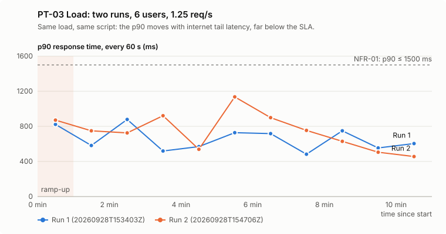
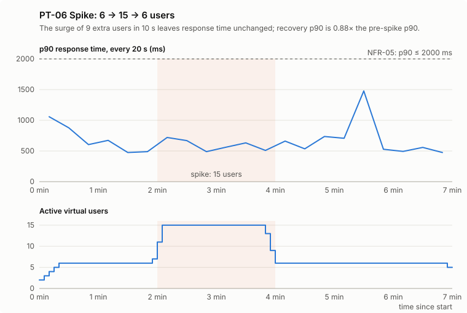

# Performance Test Summary Report — DummyJSON E-commerce API

## 1. Document control

| Version | Date | Author | Test plan | Status |
|---|---|---|---|---|
| 1.0 | 2026-09-28 | Anusree P (drafted with the perf-report skill) | [`context/perf-test-plan.md`](../context/perf-test-plan.md) v1.0, approved 2026-09-28 | Superseded by 1.1 |
| 1.1 | 2026-09-28 | Anusree P (drafted with the perf-report skill) | same | Superseded by 1.2: adds charts, the committed evidence folder, steady-state medians, UTC run-folder names, time to recover, and a peer review's corrections (repeatability judged on the steady state: 3 of 5 transactions, not 2; the baseline marked VALID; SLA generosity, NFR-05 scope and monitoring deviations stated) |
| 1.2 | 2026-09-28 | Anusree P (drafted with the perf-report skill) | same | **Final**: adds section 13, the CI load run |

## 2. Executive summary

**Verdict: all 6 runs are valid, and every gated run PASSES every SLA (NFR-01 to NFR-07).** The baseline is a reference run with no gates (verdict VALID). The DummyJSON shopper journey stayed fast and error-free from 1 up to 15 concurrent users (250% of the modelled normal load), with no degradation, and it recovered cleanly from a sudden surge.

Key findings:

1. **Normal load (6 users, 1.25 req/s) sits far inside the SLAs.** p90 per transaction was 498–757 ms against a 1500 ms target, and averages 400–514 ms against 1000 ms, in both load runs. The achieved throughput was 1.252 and 1.243 req/s, within ±10% of the 1.25 target, so the workload model was delivered as designed.
2. **No degradation up to 250% load.** Median response times at 15 users were 0.82–1.04× the single-user baseline, and the stress p90 stayed between 655 and 849 ms at every step, with 0 errors. Within the tested range, response time is governed by network latency, not by server load.
3. **Spikes are absorbed.** A jump from 6 to 15 users in 10 s changed nothing measurable: the p90 was 564 ms before and 560 ms during the spike. After the spike the p90 was 495 ms, 0.88× the pre-spike value against a 1.2× limit.
4. **One real error in 3,523 samples: a 30 s socket timeout** on `T02_Get_Current_User` in load run 2 (section 7, O-1). It started at +56.2 s, 3.8 s before the steady-state window, so NFR-03 (steady state) shows 0% while the whole run shows 0.13%. Both are reported; even counted in full, it's far under the 1% limit. It was isolated, and a similar one-off dropped connection was seen in the functional suite on 2026-09-27.
5. **Tail latency varies between runs.** The two load runs' steady-state medians agree within 7%, but their p90s differ by up to 40% (T04: 498 vs 695 ms). That breaks the plan's 10% repeatability criterion for **3 of 5 transactions** (T01, T02, T04; section 6.2). The cause is scattered 1.5–2.6 s responses over the public internet, not load.
6. **The SLAs were generous.** They were set before the JMeter baseline, from a `curl` baseline that opened a new TLS connection per request (median 618–839 ms). The JMeter baseline, with reused connections, measured medians of 300–406 ms. A p90 of 686–757 ms against a 1500 ms target means these SLAs were never close to being breached; tighter ones are recommended in section 9.

**Recommendation:** accept the SLAs as met for the tested range, and tighten them from the JMeter baseline for the next cycle. Treat the rare timeout as a known, low-frequency risk of the public service. For future comparisons, judge repeatability on medians plus a tail tolerance (section 9).

## 3. Test execution summary

All scenarios ran on 2026-09-28 in the plan's order (section 17), with gaps of at least 2 minutes and a pre-run check before each.

| # | Run folder | Scenario | Start (UTC) | Duration | Peak users | Samples | Error % | `429`s | Min rate-limit remaining | Injector CPU (worst 15 s) | Verdict |
|---|---|---|---|---|---|---|---|---|---|---|---|
| 1 | [`20260928T152513Z-shopper-journey-smoke`](evidence/20260928T152513Z-shopper-journey-smoke.md) | PT-01 Smoke | 15:25:15 | 39 s | 1 | 10 | 0 | 0 | 96 | 7.7% | **PASS** |
| 2 | [`20260928T152808Z-shopper-journey-baseline`](evidence/20260928T152808Z-shopper-journey-baseline.md) | PT-02 Baseline | 15:28:10 | 231 s | 1 | 50 | 0 | 0 | 91 | 6.3% | **VALID** (reference, not gated) |
| 3 | [`20260928T153403Z-shopper-journey-load`](evidence/20260928T153403Z-shopper-journey-load.md) | PT-03 Load, run 1 | 15:34:04 | 660 s | 6 | 801 | 0 | 0 | 71 | 4.7% | **PASS** |
| 4 | [`20260928T154706Z-shopper-journey-load`](evidence/20260928T154706Z-shopper-journey-load.md) | PT-03 Load, run 2 | 15:47:08 | 660 s | 6 | 795 | 0.13 | 0 | 85 | 4.3% | **PASS** |
| 5 | [`20260928T160010Z-shopper-journey-stress`](evidence/20260928T160010Z-shopper-journey-stress.md) | PT-05 Stress | 16:00:12 | 599 s | 15 | 1,125 | 0 | 0 | 76 | 4.3% | **PASS** |
| 6 | [`20260928T161214Z-shopper-journey-spike`](evidence/20260928T161214Z-shopper-journey-spike.md) | PT-06 Spike | 16:12:15 | 420 s | 15 | 742 | 0 | 0 | 82 | 5.3% | **PASS** |

- **Total: 3,523 samples, 1 error, 0 rate-limit responses, 0 INVALID runs.**
- Every sample except the timed-out one came back `cf-cache-status: DYNAMIC`, so the whole test measured the origin server, not the CDN cache.

## 4. Test environment and conditions

| Item | Detail |
|---|---|
| Target | `https://dummyjson.com`, public production, behind Cloudflare |
| Load generator | One local Linux machine, Java 21, **Apache JMeter 5.6.3** in non-GUI mode, one IP over the public internet |
| Script | `test-plans/shopper-journey.jmx`: T01–T05, think time 2–4 s, pacing 24 s, Constant Throughput Timer ceiling 5 req/s, stop on `429` |
| Monitoring | Client side only: JMeter metrics, the `cf-cache-status` and `x-ratelimit-remaining` headers per sample, and the injector CPU every 5 s. No server-side access. |
| Injector health | Worst 15 s CPU average **7.7%** (limit 80%), so JMeter was never the bottleneck |
| Rate-limit headroom | The lowest `x-ratelimit-remaining` seen was **71 of 100**, in load run 1, so at least 71% of the budget was always free |

## 5. SLA compliance

SLA values are the plan's **assumed** SLAs (DummyJSON publishes none), signed off in plan v1.0. Load checks use the steady state (60–660 s); stress uses the 12-user step (360–480 s); spike uses its windows (plan section 7).

| NFR | Requirement | Scenario | Target | Actual (worst transaction / overall) | Status |
|---|---|---|---|---|---|
| NFR-01 | p90 per transaction, normal load | PT-03 run 1 / run 2 | ≤ 1500 ms | 714 ms (T05) / 757 ms (T01) | ✅ PASS |
| NFR-02 | Average per transaction, normal load | PT-03 run 1 / run 2 | ≤ 1000 ms | 477 ms (T01) / 514 ms (T01) | ✅ PASS |
| NFR-03 | Error rate, normal load | PT-03 run 1 / run 2 | < 1% | 0% / 0% (steady state) | ✅ PASS |
| NFR-04 | Throughput achieved | PT-03 run 1 / run 2 | 1.125–1.375 req/s | 1.252 / 1.243 req/s | ✅ PASS |
| NFR-05 | p90 per transaction at peak | PT-05 (12 users) / PT-06 (15 users) | ≤ 2000 ms | 796 ms (T01) / 729 ms (T01) | ✅ PASS |
| NFR-05 | Error rate at peak | PT-05 / PT-06 | < 2% | 0% / 0% | ✅ PASS |
| NFR-06 | Recovery after the spike | PT-06 | ≤ 1.2× pre-spike p90 | 0.88× (495 vs 564 ms) | ✅ PASS |
| NFR-07 | Rate-limit responses | all runs | 0 | 0 | ✅ PASS |

Every individual check, per transaction and per run, is in [`evidence/analysis.md`](evidence/analysis.md). Each run's own verdict summary is in [`evidence/`](evidence/), linked from the table in section 3. Both are regenerated from the raw results: `scripts/evaluate-run.py` writes each summary, and `scripts/build-report-data.py --evidence` copies them and writes the analysis.

## 6. Detailed results

Times in milliseconds, whole run unless a window is named. The percentile method is the same as JMeter's dashboard; the numbers were cross-checked, and every dashboard matches its summary exactly.

### 6.1 Baseline (PT-02): 1 user, 10 iterations

| Transaction | Samples | Avg | Median | p90 | Max |
|---|---|---|---|---|---|
| T01_Login | 10 | 484 | 367 | 1093 | 1119 |
| T02_Get_Current_User | 10 | 337 | 300 | 562 | 582 |
| T03_Browse_Products | 10 | 440 | 406 | 590 | 594 |
| T04_Search_Products | 10 | 406 | 371 | 668 | 691 |
| T05_View_Product | 10 | 384 | 355 | 479 | 480 |
| **All** | 50 | 410 | 360 | 579 | 1119 |

With 10 samples per transaction, a p90 is effectively the slowest sample, so **medians** are the reliable baseline reference (used in 6.2 and 6.3). JMeter reuses connections, which is why these medians are roughly half those of the one-off `curl` baseline in `context/perf-context.md` (median 618–839 ms), where every request opened a new TLS connection.

### 6.2 Load (PT-03): 6 users, steady state 60–660 s

All figures are for the **steady state**, the window the SLAs are judged on. They are copied from [`evidence/analysis.md`](evidence/analysis.md).

| Transaction | Run 1 avg | Run 2 avg | Δ avg | Run 1 p90 | Run 2 p90 | Δ p90 | Run 1 median | Run 2 median | Δ median | Consistent (≤ 10%) |
|---|---|---|---|---|---|---|---|---|---|---|
| T01_Login | 477 | 514 | 7.8% | 686 | 757 | **10.4%** | 392 | 418 | 6.8% | **no** |
| T02_Get_Current_User | 406 | 457 | **12.4%** | 594 | 732 | **23.3%** | 329 | 338 | 2.7% | **no** |
| T03_Browse_Products | 411 | 446 | 8.5% | 632 | 665 | 5.1% | 341 | 347 | 1.8% | yes |
| T04_Search_Products | 400 | 431 | 7.8% | 498 | 695 | **39.6%** | 334 | 344 | 3.0% | **no** |
| T05_View_Product | 435 | 446 | 2.6% | 714 | 723 | 1.3% | 337 | 342 | 1.5% | yes |

**Repeatability** (plan section 7: average and p90 within 10%): met by T03 and T05; **not met by T01, T02 and T04 (3 of 5)**.

Investigation, as the plan requires:
- **The medians agree within 1.5–6.8%,** so typical behaviour repeats. The misses are all in the slow tail: T01's p90 by 0.4 points, T02 and T04 clearly.
- **Run 2 caught more slow requests.** Its steady state had more 1.5–2.6 s responses (T02: 9 requests over 1 s against 2 in run 1). In those, `Latency` ≈ elapsed time and `Connect` = 0, so the time was spent waiting for the first byte on an already-open connection.
- **The slow responses show no pattern:** they're spread over every transaction and every virtual user, with nothing tied to time or step. That points to latency variance on the internet path or at the shared service, not to load: the load was identical in both runs (1.252 vs 1.243 req/s).
- **The sample size limits p90 stability.** About 150 steady-state samples per transaction puts the p90 at the 15th-slowest request, so a few extra slow requests move it a lot. The plan's claim that about 750 samples per run give "stable percentiles" (plan section 7) holds for the median, not for the p90.
**Load vs baseline (medians; load run 2 steady state vs the baseline's whole run):** 0.85–1.14×. In effect there's no degradation from 1 to 6 users.

### 6.3 Stress (PT-05): step-up from 3 to 15 users

| Step | Window | Samples | Avg | p90 | Errors | Throughput |
|---|---|---|---|---|---|---|
| 3 users | 0–120 s | 77 | 517 | 849 | 0% | 0.64 req/s |
| 6 users | 120–240 s | 151 | 426 | 646 | 0% | 1.26 req/s |
| 9 users | 240–360 s | 226 | 480 | 711 | 0% | 1.88 req/s |
| 12 users | 360–480 s | 301 | 410 | 655 | 0% | 2.51 req/s |
| 15 users | 480–600 s | 370 | 464 | 756 | 0% | 3.08 req/s |

- **Throughput scaled linearly with users** (0.64 → 3.08 req/s, as the workload model predicted: 0.208 req/s per user), and **response time stayed flat**.
- The highest p90 was at the *lowest* step (3 users). That's consistent with connection and TLS warm-up in the first minutes, not with load.
- At 15 users, the median per transaction was 0.82–1.04× the baseline.
- **No saturation point was reached.** As designed, stress stopped at 31% of the rate limit (plan section 3.2), so the API's capacity limit remains unknown.

### 6.4 Spike (PT-06): 6 → 15 → 6 users

| Window | Seconds | Users | Samples | Avg | p90 | Errors | Throughput |
|---|---|---|---|---|---|---|---|
| Pre-spike | 60–120 | 6 | 73 | 408 | 564 | 0% | 1.22 req/s |
| Spike | 120–240 | 15 | 375 | 405 | 560 | 0% | 3.13 req/s |
| Recovery | 360–420 | 6 | 78 | 368 | 495 | 0% | 1.30 req/s |

- The 9 extra users all logged in within 10 s. The resulting burst of logins didn't move T01's p90 above 729 ms.
- Response times were no different during the spike, and recovery was immediate (0.88× the pre-spike p90).
- **Time to recover:** the first 20 s window after the spike ended (240–260 s) already had a p90 of 661 ms, within 1.2× the pre-spike 564 ms (limit 677 ms). Three later 20 s windows went above the limit (280–340 s: 736, 707 and 1478 ms), but each holds only about 25 samples, so one or two slow requests set its p90. NFR-06 is judged on the plan's 60 s recovery window (360–420 s).
- One 20-second window after the spike (320–340 s) shows a p90 of about 1.5 s. It holds 23 samples, 2 of them slow (T05 2.1 s and T01 1.9 s), both from the same virtual user. That's the O-2 tail pattern, not an after-effect of the spike: the windows either side are back at about 500–700 ms.

## 7. Observations

| ID | Observation | Evidence | Severity |
|---|---|---|---|
| O-1 | **One socket timeout (30 s)** on `GET /auth/me`. JMeter received no response in 30 s (`java.net.SocketTimeoutException`); the sample took 37.1 s in total. It was isolated: the requests before and after were normal, and the same user's login 6 s earlier had needed a new connection (`Connect` 257 ms) and took 2.5 s. | Load run 2, +56.2 s (15:48:04 UTC), thread `TG1 1-6`. It fell in ramp-up, outside the 60–660 s SLA window, so it counts in the whole-run error rate (0.13%) but not in NFR-03. | Low: 1 in 3,523 (0.03%). A similar one-off dropped connection was seen by the functional suite on 2026-09-27 ([`ecommerce-api-automation/context/api-context.md`](https://github.com/Anusreepsuresh074/ecommerce-api-automation/blob/main/context/api-context.md)). |
| O-2 | **Tail latency of 1.5–3.5 s** appears at every load level: 1.2–2.5% of requests in the load, stress and spike runs (none in smoke and baseline, which had only 60 samples between them). | Requests over 1.5 s are spread across all transactions and users, with `Latency` ≈ elapsed and `Connect` = 0 (waiting for the first byte). The p99 per transaction is 1.3–3.0 s in those runs, not counting the O-1 timeout. | Low. It doesn't breach any SLA, but it drives the run-to-run p90 variance. |
| O-3 | **Load repeatability not met for 3 of 5 transactions** (T01, T02, T04) under the plan's 10% rule. | Section 6.2 | Medium, for how results are interpreted: p90 comparisons between runs from this setup need a wider tolerance. |
| O-4 | **No measurable degradation from 1 to 15 users.** | Sections 6.2–6.3: flat p90; medians 0.85–1.14× baseline at 6 users, 0.82–1.04× at 15 users | Informational |
| O-5 | **Rate-limit headroom varied independently of our load.** In load run 1, `x-ratelimit-remaining` fell to 71, while our own traffic was about 12.5 requests per 10 s. | `summary.json` of run 3 | Informational. It confirms the plan's risk that the limit is shared with other traffic on the same IP (or counted per server instance), and it justifies the 50% margin. |
| O-6 | **Every sample reached the origin** (`DYNAMIC`), so the randomized `skip` and correlated `productId` worked as designed. | Cache split in every summary | Informational |

## 8. Bottlenecks and risks

- **No bottleneck was found within the tested range** (up to 3.1 req/s, 15 users). Server-side resource data isn't available, so this statement is limited to what the client can see.
- **Risk: rare timeouts (O-1).** A client of this API should set a timeout and retry idempotent reads. The functional suite already retries network errors only.
- **Risk: the capacity limit is unknown.** The rate limit (100 requests per 10 s per IP) is the effective ceiling for any single client, well before any server limit could be observed.

## 9. Recommendations

1. **Accept the SLAs as met** for the tested range (up to 250% of the modelled normal load).
2. **Re-baseline the SLAs** in the next plan version from the JMeter baseline and load results rather than the `curl` baseline, for example p90 ≤ 1000 ms and average ≤ 600 ms at normal load. The current targets are more than 2× the measured values, so they would miss a real regression. This is a plan change, needing sign-off.
3. **Update the repeatability criterion** in the next plan version: medians within 10% **and** p90 within 25% for runs over the public internet, or three load runs with the middle one reported. This is a plan change for `perf-test-design`, needing sign-off.
4. **Increase steady-state samples** if tighter p90 comparisons are needed: a longer steady state, if fair use allows, or more runs spread across the day.
5. **Watch for O-1 in CI.** If timeouts start appearing regularly in the smoke runs, raise it as an observation with DummyJSON's maintainer.
6. **For capacity testing,** use an environment you own, for example a self-hosted DummyJSON (it's open source) with no rate limit and with server monitoring. That's where endurance, breaking-point and scalability tests belong.

## 10. Deviations from the test plan

| Plan item | Deviation | Impact |
|---|---|---|
| Test data (section 10) | `perfume` returned 0 products during the `[To verify]` check and was dropped; 9 search terms were used | None: every term returned results in every run |
| PT-03 repeatability (section 7) | Criterion not met for T01, T02 and T04; investigated (section 6.2) and reported rather than re-run | Interpretation only; SLA results are unaffected |
| Pre-run minimum (section 12.1) | The ≥ 80 rate-limit headroom is checked at the start of each run, as planned. During load run 1 it fell to 71. | None: no `429`; the plan doesn't require headroom during a run |
| Suspension criteria (section 12.3) | Only the `429` rule stops a run live, built into the script. The error-rate rule (> 10% for 1 minute) and the injector-CPU rule (> 80%) are evaluated from the results after the run, and they mark it INVALID if broken. | None this time: neither was ever close (worst 60 s error rate 2.0%, from the O-1 timeout, against a 10% limit; worst CPU 7.7% against 80%). A live check for both would need a JMeter listener or an external watchdog; it's listed as a script improvement. |

| Load-generator monitoring (section 11) | The plan says the injector's CPU and memory are sampled; only CPU was (every 5 s, from `/proc/stat`) | Low: CPU never passed 7.7%, and JMeter ran with its default heap without any memory warning in `jmeter.log`. Memory sampling is a script improvement. |
| NFR-05 scope (section 5) | NFR-05 is labelled "peak (200% of normal)" but lists "the peak of PT-06" in its scope, and PT-06 peaks at 15 users (250%). It was applied as its scope states: at the 12-user step of PT-05 **and** at PT-06's 15-user spike. | None: applying a 200% SLA at 250% load is stricter, and it passed |

No run was suspended, repeated or excluded.

## 11. Limitations

- **Assumed SLAs:** no stakeholder SLA exists, so the targets are the plan's signed-off assumptions.
- **Client-side view only:** no server CPU, memory or APM data, so causes on the server side can't be confirmed.
- **Public internet and one load generator:** the numbers include this network's latency; runs from elsewhere (for example CI) aren't directly comparable.
- **Shortened durations** (10-minute steady state; no endurance test) out of fairness to a free public service. About 150 steady-state samples per transaction give a stable median but a noisy p90 (section 6.2).
- **Generous SLAs:** set from a `curl` baseline before the JMeter baseline existed (section 2, finding 6).
- **"Stress" is a step-load trend test,** not a breaking-point test: it stayed at 31% of the rate limit by design (plan section 3.2).
- **Load stayed far below capacity** (at most 31% of the rate limit), so the results say nothing about behaviour near the API's limits.

## 12. Appendix

- **Evidence** (committed): [`evidence/`](evidence/) holds each run's `summary.md`, the verdict with every NFR check and its steady-state table, plus `analysis.md`, every table this report draws on. Both are produced from the raw results by `scripts/evaluate-run.py` (per run) and `scripts/build-report-data.py --evidence` (the copy into `docs/evidence/`).
- **Charts** (committed): `images/*.svg`, built from the raw results with `scripts/build-charts.py <load run 1> <load run 2> <stress run> <spike run>`.
- **Run folders** (not committed): `results/<run>/` holding `results.jtl`, `jmeter.log`, `injector-cpu.csv`, `summary.json` and `summary.md`. Folder names are the UTC start time.
- **Dashboards** (not committed; CI publishes its smoke and load dashboards to GitHub Pages): `reports/<run>/index.html`.
- **Reproduce:** see the README, *Running it*. The order is `scripts/run-scenario.sh smoke`, then `baseline`, `load` (twice), `stress`, `spike`, then `scripts/build-dashboard.sh results/<run>`, `scripts/build-report-data.py --evidence` and `scripts/build-charts.py`.

## 13. Addendum: the load test from CI (GitHub Actions)

After the push, PT-03 load was also run once from a GitHub Actions runner (started by hand, as plan section 13 allows): run `20260928T180910Z-shopper-journey-load`, evidence in [`evidence/ci-20260928T180910Z-shopper-journey-load.md`](evidence/ci-20260928T180910Z-shopper-journey-load.md). A CI smoke run before it also passed.

| Item | CI load run | Local load runs (section 6.2) |
|---|---|---|
| Verdict | **PASS** | PASS, PASS |
| p90, worst transaction (steady state) | 303 ms (T01) | 714 / 757 ms |
| Median, overall (steady state) | 112 ms | about 330–420 ms per transaction |
| Throughput (steady state) | 1.243 req/s | 1.252 / 1.243 req/s |
| Errors | 1 in 797 (0.13%): a `SocketException` (connection dropped) on T01 after 63 ms, inside the steady state | 0 / 1 (the timeout, before the steady state) |
| Lowest `x-ratelimit-remaining` | **42** | 71 / 85 |
| Injector CPU, worst 15 s | 10.3% | 4.7% / 4.3% |

What it adds:
- **Location changes the numbers, as the plan warned (section 8).** From GitHub's data centre, close to Cloudflare, responses were 2–5× faster than from the local network. The throughput was identical, so the workload model held. The CI and local runs measure different network paths, so their times are not compared against each other.
- **The shared-IP risk is real.** The rate-limit budget fell to 42 of 100 while this test used about 12 per 10 s, so other traffic from the runner's IP used the rest. That confirms why stress and spike stay out of CI.
- **The rare connection failure recurred:** now 2 in about 4,330 requests across all runs (O-1 plus this one), both transient network errors on a single request. It supports recommendation 5 (watch it in CI).
